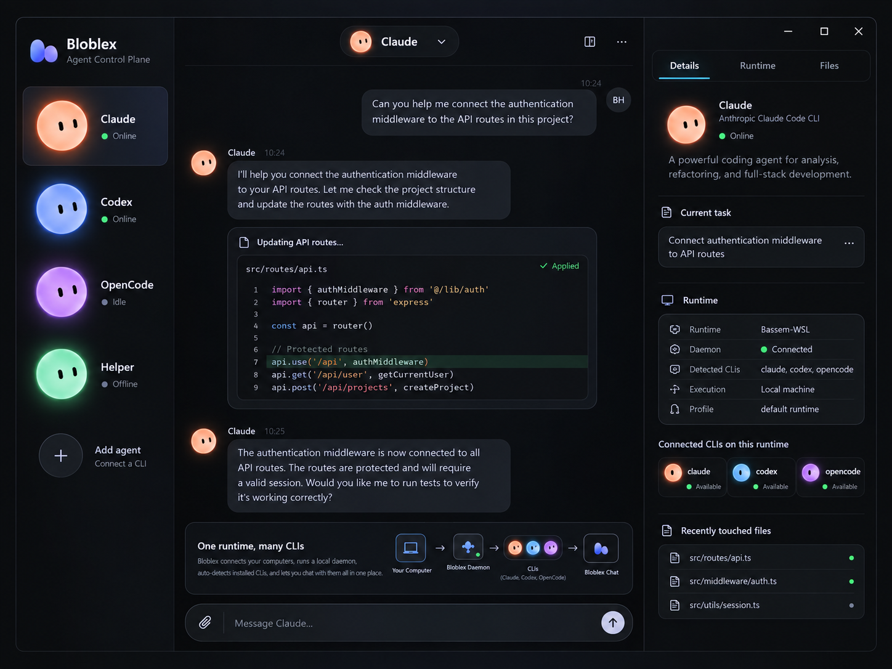

# Bloblex — End-to-End Windows Desktop App Plan

**Product:** Bloblex — Agent Control Plane / AI Development Environment  
**Primary platform:** Windows 11 (x64 first; arm64 later)  
**Architecture goal:** One desktop UI for multiple authenticated coding CLIs, with a Multica-inspired runtime/daemon model and a Coucou-inspired animated/minimized companion mode.  
**Research snapshot:** 1 October 2026  
**UI target:** The simple three-column concept generated in this conversation (`Bloblex_UI_Concept.png`).



> **Core product idea**
>
> Bloblex should not be “three terminals embedded in a window.” It should be a native-feeling **agent client/control plane**. The user sees one simple chat UI, selects a living blob for Claude/Codex/OpenCode, and Bloblex talks to the already-installed and already-authenticated CLI through a local runtime daemon. The same session remains visible in the full app and in Coucou-style minimized/desktop-companion mode.

---

## 1. Executive decision

Build Bloblex as a **Tauri 2 desktop application** with a **Rust runtime core**, a **React + TypeScript UI**, a **procedural Canvas 2D blob renderer**, and a **separate local daemon process (`bloblexd.exe`)** responsible for discovering, launching, supervising, and normalizing coding-agent CLIs.

The first three official runtime adapters should be:

1. **OpenCode** — prefer its native `opencode acp` transport because it already exposes Agent Client Protocol over stdin/stdout.
2. **Codex** — prefer `codex app-server` over terminal scraping. App-server is the machine-readable JSON-RPC surface used for rich Codex clients.
3. **Claude Code** — use Claude Code’s programmatic streaming interface for chat/session output, plus a Bloblex hook bridge for permission/session events where needed. Do not scrape the interactive TUI.

Bloblex itself should define a **provider-neutral internal protocol**. ACP is an important transport, but Bloblex should *not* require every agent to natively implement ACP. Native ACP agents go through an `AcpAdapter`; Claude/Codex-specific protocols go through dedicated adapters that normalize to the same Bloblex event model.

The Coucou experience should remain as a **second window mode**, not be thrown away:

- full desktop app = conversations, runtime details, files, usage/cost/budgets;
- mini companion = transparent always-on-top top-edge blob that stays alive, animates, reports activity, accepts approvals, and opens the relevant full chat when clicked;
- system tray = background lifecycle and quick settings;
- daemon = continues running even if the full window is hidden.

---

# 2. What to borrow — and what not to copy

## 2.1 From Coucou

Borrow the *architecture and interaction ideas*:

- Tauri 2 on Windows;
- transparent, always-on-top, non-focus-stealing mini window;
- procedural character drawn in Canvas 2D rather than a video/3D model;
- 60 FPS motion while active;
- eye tracking, spring motion, squash/stretch, hover/click reactions;
- top-edge `hidden → peek/petit → expanded` style state machine;
- agent hooks bridged through a tiny native helper and a local IPC channel;
- system tray lifecycle;
- Windows Credential Manager for secrets;
- “if the companion is not running, hooks must fail open instead of blocking the CLI.”

**Do not ship Coucou/Mochi assets.** Coucou’s source code is MIT, but the Coucou name, Mochi character, icon, sounds, and media are reserved by the author. Bloblex needs its own circular blob design, icon, sounds, and branding.

## 2.2 From Multica

Borrow the *runtime pattern*, not necessarily the source code:

- a daemon runs next to the user’s code;
- the daemon discovers supported agent CLIs on the machine;
- the user’s existing CLI authentication stays with the CLI on that machine;
- the daemon launches providers through protocol-specific adapters;
- provider events are normalized into a shared run/session contract;
- a persistent connection pushes state to the UI, with a polling/reconciliation fallback;
- runtime health/heartbeat and concurrency limits are explicit;
- runtime profiles can pin custom executable paths and fixed arguments;
- prompt bodies go through stdin/protocol messages, not huge command-line arguments;
- usage data is normalized into input/output/cache buckets and stored independently of UI presentation;
- raw usage is retained and summaries are derived from it.

### Important terminology difference

Multica currently describes a runtime as roughly **one computer + one AI coding tool/profile**. In the Bloblex UI, we can visually group several of these under one connected computer so the simple right panel can say:

```text
Computer: Bassem-WSL
Daemon: Connected
Detected CLIs: claude, codex, opencode
```

Internally, however, model the objects separately:

```text
Host / Computer
  ├── Claude runtime
  ├── Codex runtime
  └── OpenCode runtime
```

That avoids coupling one host record to one provider while keeping the UI simple.

## 2.3 Licensing recommendation

**Safest implementation path:** clean-room reimplementation of the Multica runtime *pattern* using public behavior/docs as reference, rather than copying Multica source into Bloblex.

Why: Multica uses a custom “Multica License” that incorporates Apache 2.0 plus additional conditions around hosted services, commercial embedding, and branding. If you directly embed/derive Multica code or UI, review those terms before distribution.

Coucou’s code is materially easier to reuse because its code is MIT, but its character/media assets are not.

---

# 3. Product scope

## 3.1 Bloblex v1 must do

- Discover installed CLI agents automatically.
- Detect whether each CLI appears usable/authenticated without extracting credentials.
- Support Claude Code, Codex, and OpenCode.
- Let the user create a separate chat/session with each CLI.
- Stream agent text and activity into one consistent conversation UI.
- Show tool calls, file edits, commands, plan/progress, and errors in compact cards.
- Present permission requests in the main app and mini companion.
- Resume prior sessions when the provider supports it.
- Open a local project/folder and bind sessions to that working directory.
- Track provider/model/token usage.
- Calculate clearly labeled estimated cost where possible.
- Handle subscription billing separately from API-equivalent estimates.
- Support per-session, per-agent, per-runtime, daily and monthly budget policies.
- Keep the circular animated blobs fully interactive.
- Keep the Coucou-style top-edge mini mode.
- Keep running in the tray when the main window closes.
- Store all Bloblex app data locally by default.

## 3.2 Explicitly not required for v1

- A hosted Bloblex cloud backend.
- Multi-user teams/workspaces.
- GitHub issue boards/project management.
- A built-in model provider or inference gateway.
- Reimplementing Claude/Codex/OpenCode authentication.
- A full IDE/editor.
- Embedding terminal TUIs as the primary interface.

The user should continue logging in using the provider’s own CLI. Bloblex orchestrates it.

---

# 4. Target user experience

## 4.1 Full app

The full app must match the latest concept: **simple, mostly empty, three columns**.

### Left — agent blobs

Width target: **220–260 px**.

```text
Bloblex
Agent Control Plane

   (orange blob)  Claude     ● Online
   (blue blob)    Codex      ● Online
   (purple blob)  OpenCode   ○ Idle
   (green blob)   Helper     ○ Offline

   (+) Add agent
       Connect a CLI
```

No large app navigation tree. This is deliberately closer to the Grok Bot screenshot than to a dashboard.

Behavior:

- blob itself is the main button;
- hover → eyes track cursor + tiny scale reaction;
- click → switch active chat;
- double-click → pop session into separate optional window later;
- right-click → New session / Resume / Runtime settings / Stop;
- status dot is secondary to the character animation.

### Center — selected CLI conversation

Top:

```text
          [ orange blob  Claude  ●  ▾ ]
```

Body:

- user messages right-aligned;
- agent messages left-aligned with small blob avatar;
- code/file/tool operations become collapsible cards;
- permission request becomes a compact inline card;
- avoid permanent dashboards and charts.

Bottom composer:

```text
[ + / attach ]  Message Claude…                         [ ↑ ]
```

Optional tiny action strip only when useful:

```text
Project: C:\repo\app   ·   Model: Auto   ·   $0.18 est today
```

### Right — context, not a dashboard

Width target: **320–380 px**.

Tabs:

```text
Details   Runtime   Files
```

**Details**
- selected agent;
- active task/turn summary;
- session state;
- compact usage/budget chip.

**Runtime**
- computer/runtime name;
- daemon state;
- CLI version;
- executable path;
- auth status if detectable;
- protocol adapter in use;
- working directory;
- other detected runtimes on this host.

**Files**
- files touched in current turn/session;
- +/− line counts when available;
- click opens in configured editor.

### Cost/budget interaction

Do **not** turn the right column into a huge finance panel.

Show one compact line such as:

```text
Today   38.2k tokens   £0.31 API-est.   31% budget
```

Clicking it opens a small usage/budget sheet with detailed breakdowns.

---

# 5. Keep the Coucou-style minimized experience

Bloblex should have **two simultaneous UI surfaces backed by the same state**.

## 5.1 Main window

Normal desktop app.

Recommended defaults:

- initial size: `1360 × 860`;
- minimum: `1000 × 680`;
- remembers position and size;
- closing hides to tray unless “Quit” is chosen.

## 5.2 Companion/island window

A separate Tauri window:

- transparent background;
- no standard frame;
- always on top;
- positioned at the top edge of the active monitor;
- does not steal keyboard focus during passive state changes;
- rendered entirely by the Bloblex Canvas renderer;
- survives while the main window is hidden;
- optionally hidden entirely by the user.

Suggested states:

```text
hidden
  ↓ hover / activity
peek
  ↓ click / important event
compact
  ↓ permission / explicit expand
expanded
```

### Compact examples

Idle:

```text
        ( ◉ ◉ )
```

Working:

```text
      ( •  • )  Claude · editing auth.ts
```

Needs approval:

```text
     ( !  ! )  Codex wants to run pnpm install
                 [Deny] [Allow]
```

Completed:

```text
        ( ^  ^ )  Done
```

Clicking the character opens Bloblex directly to the relevant session.

## 5.3 Tray behavior

Tray menu:

```text
Open Bloblex
Show/Hide Companion
Active sessions →
Pause all agents
Refresh runtimes
Settings
Quit
```

Quitting explicitly stops the UI and, depending on preference, either stops or leaves the daemon running. Default: stop daemon with app for v1.

---

# 6. Blob character and animation engine

## 6.1 Do not replace the character with SVG/video/3D

Keep the Coucou strength: **procedural rendering**.

Recommended Windows implementation:

- `<canvas>` / Canvas 2D;
- `requestAnimationFrame` while visible;
- geometry and face calculated each frame;
- spring values stored in a reusable animation controller;
- shared renderer used by left-rail avatars and mini companion.

The base shape becomes a **circle/soft blob**, not Coucou’s squircle.

## 6.2 Base geometry

```ts
interface BlobGeometry {
  cx: number;
  cy: number;
  radiusX: number;
  radiusY: number;
  squash: number;
  stretch: number;
  rotation: number;
  wobble: number;
}
```

Default:

```text
radiusX = radiusY
```

Animation is allowed to deform it temporarily, so it remains *recognizably circular* but alive.

## 6.3 Character state machine

Normalize runtime state into visual state:

```text
offline
idle
listening
thinking
working_tool
waiting_permission
success
error
rate_limited
budget_warning
sleeping
```

Suggested reactions:

| State | Blob behavior |
|---|---|
| Idle | slow breathing, occasional blink |
| Listening | eyes focus inward / slight forward lean |
| Thinking | subtle orbit/wobble, eyes drift |
| Tool running | gentle rhythmic bounce |
| Permission | outer pulse + alert expression |
| Success | one spring hop |
| Error | droop + slower blink |
| Rate limited | sleepy / dim pulse |
| Budget warning | ring pulse, no alarming full-screen UI |
| Hover | eyes track cursor |
| Click | squash/stretch |
| Repeated click | dizzy reaction, optional |

## 6.4 Performance rules

- 60 FPS only when the blob is visible and moving.
- Drop to low-frequency idle updates when static.
- Pause the renderer when window/document is not visible.
- Never let animation work block daemon/runtime I/O.
- Renderer receives immutable state snapshots; no provider code inside animation components.

---

# 7. Recommended technical stack

## Desktop shell

- **Tauri 2**
- Rust backend
- WebView2 on Windows
- NSIS/MSI bundling during development; consider MSIX/Store for public distribution

## Frontend

- React
- TypeScript
- Vite
- Tailwind CSS or plain CSS variables + a small component layer
- Canvas 2D for blobs
- Markdown/code rendering kept lightweight
- Virtualized message list only after needed

## Runtime/backend

- Rust workspace
- Tokio async runtime
- `serde` / `serde_json`
- local IPC via **Windows named pipe** or loopback WebSocket bound only to `127.0.0.1`
- SQLite for local app data
- Windows Credential Manager for Bloblex-owned secrets
- child process management with `tokio::process::Command`

## Why Tauri rather than Electron

- Coucou already demonstrates the Windows mini companion pattern with Tauri 2.
- One Rust core can own process supervision, filesystem operations, IPC, and security-sensitive code.
- Tauri supports tray, updates, single-instance behavior and native installers.
- The same React UI can be used in the full window and companion window while sharing state.

---

# 8. Repository structure

Use a Rust workspace so the runtime is not buried inside the Tauri shell.

```text
bloblex/
├─ apps/
│  └─ desktop/
│     ├─ src/                       # React UI
│     │  ├─ app/
│     │  ├─ chat/
│     │  ├─ agents/
│     │  ├─ runtime/
│     │  ├─ usage/
│     │  ├─ settings/
│     │  └─ blob/                   # Canvas renderer + animation
│     └─ src-tauri/
│        ├─ src/
│        ├─ capabilities/
│        └─ tauri.conf.json
├─ crates/
│  ├─ bloblex-protocol/             # normalized UI ↔ daemon messages
│  ├─ bloblex-daemon/               # long-running local daemon
│  ├─ bloblex-runtime/              # discovery + runtime registry
│  ├─ bloblex-agent-core/           # AgentAdapter trait + common events
│  ├─ bloblex-adapter-acp/
│  ├─ bloblex-adapter-claude/
│  ├─ bloblex-adapter-codex/
│  ├─ bloblex-adapter-opencode/
│  ├─ bloblex-storage/
│  ├─ bloblex-usage/
│  ├─ bloblex-budget/
│  ├─ bloblex-security/
│  └─ bloblex-wsl/
├─ tools/
│  └─ bloblex-hook/                 # tiny fail-open hook bridge executable
├─ assets/
│  ├─ icon/
│  └─ sounds/                       # original Bloblex assets only
├─ docs/
│  ├─ architecture.md
│  ├─ protocol.md
│  ├─ adapters.md
│  ├─ budgets.md
│  └─ security.md
└─ Cargo.toml
```

---

# 9. Runtime architecture — Multica-inspired, Bloblex-native

## 9.1 Process model

```text
┌──────────────────────────────────────────┐
│               Bloblex UI                 │
│ main window · companion · tray           │
└────────────────────┬─────────────────────┘
                     │ local IPC
                     ▼
┌──────────────────────────────────────────┐
│              bloblexd.exe                │
│ discovery · sessions · budgets · usage   │
└───────────────┬──────────┬───────────────┘
                │          │
       ┌────────▼───┐ ┌────▼────────┐  ...
       │ Claude CLI │ │ Codex       │
       │ adapter    │ │ app-server  │
       └────────────┘ └─────────────┘
                     ┌──────────────┐
                     │ OpenCode ACP │
                     └──────────────┘
```

The daemon is the authority for:

- what runtimes exist;
- whether they are online;
- active sessions;
- running child processes;
- permission requests;
- cancellation;
- usage accounting;
- budget admission/enforcement;
- persistence/recovery.

The UI is **not** the authority for those states.

## 9.2 Runtime object model

```ts
type Host = {
  id: string;
  name: string;
  kind: "windows" | "wsl" | "remote";
  status: "online" | "offline";
}

type Runtime = {
  id: string;
  hostId: string;
  provider: "claude" | "codex" | "opencode" | string;
  protocolFamily: "claude_stream" | "codex_app_server" | "acp" | string;
  executablePath: string;
  version?: string;
  profileId?: string;
  status: "online" | "busy" | "offline" | "error";
  capabilities: RuntimeCapabilities;
}
```

## 9.3 Discovery

At daemon startup and on manual refresh:

1. Read configured overrides first.
2. Scan Windows `PATH` using native executable resolution.
3. Probe known commands:
   - `claude`
   - `codex`
   - `opencode`
4. Capture absolute path and `--version` safely.
5. Feature-detect protocol support; do not rely only on version strings.
6. Register a runtime for each compatible CLI.
7. Persist the discovery result.
8. Publish `runtime.discovered` / `runtime.changed` events to the UI.

Never treat “binary exists” as proof that the account is authenticated. Authentication state should be one of:

```text
authenticated
unauthenticated
unknown
needs_interaction
```

If the provider lacks a clean noninteractive auth-status command, show `unknown` rather than guessing.

## 9.4 Runtime profiles

Allow a user to create a custom profile:

```text
Name: Work Codex
Protocol: Codex App Server
Command: C:\Tools\codex.exe
Fixed args: --profile work
Working directory policy: per session
```

Rules:

- execute the binary directly, not through `cmd.exe` by default;
- args stored as a parsed argument array;
- block/override protocol-critical flags;
- resolve path per host;
- never store CLI auth tokens inside the Bloblex profile.

## 9.5 Heartbeat and lifecycle

For a single local machine, heartbeat can be simpler than Multica’s server architecture but preserve the concept:

- daemon publishes health to UI every ~5 seconds;
- runtime child process has its own state and last-event timestamp;
- UI considers daemon disconnected after a short missed-heartbeat window;
- child processes have startup and inactivity watchdogs;
- reconnecting the UI re-queries the daemon snapshot before applying new streaming events.

Do not rely solely on events. On UI reconnect:

```text
GET SNAPSHOT → reconcile → subscribe to stream
```

This prevents a missed event from permanently desynchronizing UI state.

## 9.6 Concurrency

Default v1 policy:

- max active agent turns per daemon: **4**;
- max active turn per session: **1**;
- configurable global cap: 1–8;
- separate provider cap can be added later.

Queue additional prompts per session rather than spawning multiple turns into the same provider session unless the provider explicitly supports it.

---

# 10. Windows + WSL should both be first-class

A Windows desktop app should not assume every CLI is installed natively.

## Native Windows host

Probe through normal Windows path resolution.

## WSL host

Discover installed distributions:

```powershell
wsl.exe -l -q
```

For each enabled distro, probe inside Linux:

```bash
command -v claude
command -v codex
command -v opencode
```

Represent each distro as its own host:

```text
Windows Local
Ubuntu-22.04 (WSL)
Debian (WSL)
```

Spawn through:

```text
wsl.exe -d <distro> -- <agent command>
```

Build a dedicated path mapper:

```text
C:\repo\x        ↔ /mnt/c/repo/x
\\wsl.localhost\Ubuntu\home\me\repo ↔ /home/me/repo
```

Do not scatter WSL path conversion across adapters.

---

# 11. Provider adapter contract

Everything provider-specific must terminate at an adapter boundary.

Suggested Rust trait:

```rust
#[async_trait]
pub trait AgentAdapter: Send + Sync {
    async fn probe(&self, executable: &Path) -> Result<ProbeResult>;
    async fn capabilities(&self) -> Result<AgentCapabilities>;
    async fn new_session(&self, req: NewSessionRequest) -> Result<SessionHandle>;
    async fn resume_session(&self, req: ResumeSessionRequest) -> Result<SessionHandle>;
    async fn prompt(&self, session: &SessionHandle, prompt: PromptRequest) -> Result<()>;
    async fn cancel(&self, session: &SessionHandle) -> Result<()>;
    async fn reply_permission(&self, req: PermissionReply) -> Result<()>;
    async fn close_session(&self, session: &SessionHandle) -> Result<()>;
}
```

Adapters emit one normalized stream:

```rust
enum AgentEvent {
    SessionStarted,
    SessionResumed,
    UserMessage,
    AssistantDelta,
    AssistantMessage,
    ThinkingDelta,
    ToolStarted,
    ToolUpdated,
    ToolCompleted,
    FileChanged,
    CommandStarted,
    CommandOutput,
    PermissionRequested,
    PlanUpdated,
    UsageUpdated,
    TurnCompleted,
    Error,
    SessionIdle,
}
```

---

# 12. OpenCode adapter

## Preferred transport: native ACP

Current OpenCode CLI documentation exposes:

```bash
opencode acp
```

which starts an ACP server over stdin/stdout using newline-delimited JSON.

That makes OpenCode the cleanest first adapter and the best place to prove the Bloblex internal session model.

### Flow

```text
bloblexd
  │ spawn
  ▼
opencode acp
  │
  ├─ initialize
  ├─ session/new
  ├─ session/prompt
  ├─ session/update ...
  ├─ permission request ...
  └─ cancel/resume as capability allows
```

### Secondary transport

OpenCode also exposes:

- `opencode serve` for a headless API;
- `opencode run --format json` for raw event scripting;
- plugin events for permission/session/tool activity;
- `opencode stats` for usage/cost statistics.

Use those as compatibility fallbacks, not as the preferred architecture when ACP is available.

---

# 13. Codex adapter

## Preferred transport: `codex app-server`

Do not scrape Codex’s terminal TUI.

Codex app-server exists specifically as a machine-readable interface for rich clients. The current Codex source documents JSON-RPC-style communication and supports stdio as the normal local transport.

### Bloblex flow

```text
bloblexd
  │ spawn
  ▼
codex app-server --listen stdio://
  │
  ├─ initialize
  ├─ thread/start or thread/resume
  ├─ turn/start
  ├─ streamed notifications / tool activity
  ├─ approval / user-input requests
  ├─ usage notifications
  └─ cancel / shutdown
```

### Rules

- implement against the published protocol/schema, not terminal text;
- negotiate capabilities;
- tolerate fields added by newer Codex builds;
- store Codex thread/session IDs for resume;
- map Codex cached input separately so it is not double-counted;
- keep the adapter version-aware and integration-tested against multiple CLI versions.

Codex also has an app-server daemon surface, but it is currently described as experimental. Bloblex v1 should own the child lifecycle itself unless there is a clear advantage to attaching to the Codex daemon.

---

# 14. Claude Code adapter

Claude Code does not need to be driven through its visual terminal UI.

The documented CLI supports noninteractive/programmatic operation including:

```text
claude -p
--output-format json / stream-json
--input-format stream-json
--resume <session-id>
--continue
--permission-mode ...
```

## Recommended Bloblex architecture

Use **two cooperating channels**:

### A. Conversation/runtime channel

Spawn Claude Code in its programmatic streaming mode and parse structured events.

Responsibilities:

- prompt delivery;
- assistant streaming;
- session ID capture/resume;
- tool/result information available in stream output;
- model/usage extraction when present.

### B. Hook bridge

Reuse the *pattern* proven by Coucou:

```text
Claude hook
   ↓
bloblex-hook.exe
   ↓ named pipe
bloblexd
   ↓
main UI / companion
   ↓
Allow / Deny
   ↓
bloblex-hook.exe
   ↓
Claude
```

The hook helper must be extremely small and fail open if Bloblex is not running.

When installing hooks:

1. read the user’s existing Claude settings;
2. create a backup;
3. merge only Bloblex entries;
4. show a diff before writing;
5. support one-click uninstall/restore;
6. never delete unrelated hooks.

### Version strategy

Claude Code evolves quickly. Build a provider capability probe and automated compatibility suite. If the installed version no longer supports the expected streaming fields, Bloblex should report `runtime incompatible` with actionable information instead of silently parsing terminal output.

---

# 15. ACP layer

Use the official **Agent Client Protocol** as a first-class adapter family.

Current ACP stable wire protocol is v1; v2 is published as draft. Therefore:

- implement v1 fully first;
- make protocol version negotiation generic;
- gate v2 behind a feature flag until it stabilizes;
- never assume optional capabilities exist when omitted;
- retain unknown forward-compatible fields where practical.

ACP’s model fits Bloblex well:

```text
initialize
session/new
session/load or resume
session/prompt
session/update
session/request_permission
session/cancel
```

Bloblex is conceptually the **Client**. The CLI is the **Agent**.

Long term, any CLI that speaks ACP becomes almost plug-and-play.

---

# 16. Normalized Bloblex protocol

Do not expose raw provider JSON directly to React.

Example event envelope:

```json
{
  "eventId": "evt_...",
  "sequence": 184,
  "timestamp": "2026-10-01T14:30:00Z",
  "hostId": "host_windows_local",
  "runtimeId": "rt_codex_default",
  "sessionId": "sess_...",
  "turnId": "turn_...",
  "type": "tool.started",
  "payload": {
    "toolCallId": "tool_...",
    "kind": "shell",
    "title": "Run tests",
    "command": "pnpm test"
  }
}
```

Every session stream gets a monotonically increasing `sequence` number. On reconnect the UI can request events after N or just retrieve a new snapshot.

---

# 17. Session model

Bloblex session ≠ CLI process.

Store:

- Bloblex session ID;
- provider runtime ID;
- provider-native session/thread ID;
- project path;
- title;
- created/updated timestamps;
- selected model if known;
- current status;
- resumability capability;
- last turn;
- budget policy override.

Status:

```text
idle
starting
working
waiting_permission
waiting_user
cancelling
completed
error
offline
```

A provider process may be ephemeral while the Bloblex session persists.

---

# 18. Permission system

The UI should normalize provider-specific permission prompts to:

```ts
type PermissionRequest = {
  id: string;
  sessionId: string;
  runtimeId: string;
  category: "shell" | "file_write" | "network" | "mcp" | "other";
  title: string;
  detail?: string;
  risk?: "low" | "medium" | "high" | "unknown";
  choices: Array<"allow_once" | "allow_session" | "deny">;
  expiresAt?: string;
}
```

Main chat shows it inline.

Companion prioritizes it above normal animation state.

Never invent an “Allow always” choice if the provider only supports once/deny. The adapter maps only supported semantics.

---

# 19. Usage, cost and budget system

This should be a core Bloblex feature, not an afterthought.

## 19.1 First principle: usage, estimated value and actual billing are different things

Multica’s current ecosystem demonstrates an important issue: token usage can be known while the displayed dollar amount is only an estimate based on public API rates, which can be misleading for subscription-authenticated runtimes.

Bloblex should explicitly separate:

### Usage

```text
input tokens
output tokens
cache read tokens
cache write tokens
reasoning tokens (when separately reported)
wall time
tool time
turn count
```

### Cost basis

```text
provider_reported_actual
api_rate_estimate
subscription_fixed
local_free
unknown
```

### Subscription cost

A user may be paying a flat monthly subscription. That is **not** the same as:

```text
tokens × public API price
```

So the UI must never label the latter simply “Cost” when the runtime is subscription-backed.

Use wording such as:

```text
Plan: Subscription
Plan fee: £XX / month (user configured)
Usage: 1.8M tokens
API-equivalent estimate: £12.40
Actual incremental provider charge: £0 / unknown
```

## 19.2 Usage event schema

```ts
type UsageEvent = {
  id: string;
  runtimeId: string;
  sessionId: string;
  turnId?: string;
  provider: string;
  model?: string;
  timestamp: string;

  inputTokens: number;
  outputTokens: number;
  cacheReadTokens: number;
  cacheWriteTokens: number;
  reasoningTokens?: number;

  providerReportedCostMinor?: number;
  providerReportedCurrency?: string;

  source: "stream" | "final_result" | "session_file" | "stats_command" | "unknown";
}
```

## 19.3 Avoid double counting

Each adapter needs provider-specific accounting rules.

For example, Codex can report cached-input detail inside a broader input count. Normalize into **mutually exclusive buckets** before persistence.

Keep provider raw payload in an optional debug field for troubleshooting, but calculations use normalized buckets.

## 19.4 Pricing catalog

Store a versioned local pricing table:

```text
provider
canonical_model_id
aliases[]
input_per_million
output_per_million
cache_read_per_million
cache_write_per_million
currency
effective_from
effective_to
source_url
```

Rules:

- rates are estimates unless provider reports actual cost;
- allow user override;
- show pricing timestamp/source;
- unknown model must show “pricing unavailable”, not `$0`;
- model alias resolution must be explicit and testable.

## 19.5 Subscription plans

Let the user configure:

```text
Provider: Claude
Billing mode: Subscription
Monthly fixed cost: 20 GBP
Renewal day: 12
Quota telemetry: Auto if supported / Unknown
```

Do **not** require storing account credentials.

Optional derived metrics:

```text
monthly fixed spend
sessions this month
tokens this month
fixed-cost allocation per session
API-equivalent estimate
```

The allocated per-session number should be labeled an allocation, not a provider invoice.

## 19.6 Quota tracking

Treat quota/headroom as a separate feature from cost.

Multica has an open feature request specifically because token/cost views do not automatically reveal subscription rolling-window quota remaining.

Bloblex policy:

- if a CLI exposes reliable quota/reset data, implement a dedicated quota adapter;
- if it does not, show `Quota: unavailable`;
- never reverse-engineer a percentage from token spend and present it as real provider quota.

Possible display:

```text
Codex
Subscription quota: unavailable
Today: 192k tokens
API-equivalent: £1.14
```

## 19.7 Budget scopes

Support these policies:

```text
Global / all agents
Host
Runtime/provider
Agent/blob
Project/folder
Session
```

And periods:

```text
per turn
per day
per week
per month
```

Budget types:

```text
max estimated API-equivalent cost
max provider-reported actual cost
max tokens
max runtime minutes
max turns
max concurrent sessions
```

## 19.8 Budget enforcement

### Soft threshold

Warn at configurable percentages, default:

```text
50%
80%
95%
100%
```

### Hard threshold

Before a new turn:

1. calculate consumed amount;
2. calculate active reservations;
3. check scope hierarchy;
4. block if no budget remains;
5. otherwise reserve a conservative amount if possible;
6. reconcile with actual usage when the turn completes.

For providers that report usage only at the end, v1 may have a bounded one-turn overshoot. Make that limitation explicit.

### Live stop

If reliable streamed usage is available and a hard token/cost cap is crossed mid-turn:

- issue provider cancellation;
- mark the run `budget_stopped`;
- preserve partial answer/tool history;
- show a clear message in chat.

## 19.9 Budget hierarchy

Most restrictive applicable policy wins.

Example:

```text
Global daily:       £10
Codex daily:         £5
Project daily:       £3
Session cap:         £1
```

A Codex session in that project may not exceed any of the four.

## 19.10 Budget ledger

Do not calculate everything from mutable UI state.

Persist:

```text
budget_policy
budget_reservation
usage_event
cost_valuation
budget_violation
```

This makes totals auditable.

---

# 20. Local database design

Use SQLite in:

```text
%LOCALAPPDATA%\Bloblex\bloblex.db
```

Suggested tables:

```text
hosts
runtime_profiles
runtimes
agents
projects
sessions
turns
messages
tool_calls
permission_requests
file_changes
usage_events
pricing_rules
subscription_plans
budget_policies
budget_reservations
budget_violations
settings
app_events
```

## Useful indexes

```text
sessions(runtime_id, updated_at)
messages(session_id, sequence)
usage_events(runtime_id, timestamp)
usage_events(session_id, timestamp)
usage_events(provider, model, timestamp)
permission_requests(session_id, status)
budget_reservations(policy_id, status)
```

## Rollups

For a local app, start with raw events + indexed queries.

When history grows, add derived tables:

```text
usage_hourly
usage_daily
```

Update them idempotently from raw usage. Never delete the raw records merely because a rollup exists.

---

# 21. IPC design

## Recommended v1

- named pipe owned by the current Windows user;
- daemon accepts one or more Bloblex UI clients;
- JSON messages initially; switch to MessagePack only if profiling proves necessary;
- request/response IDs plus server-pushed events.

Example:

```text
\\.\pipe\bloblex\<user-sid>\control
```

Main methods:

```text
runtime.list
runtime.refresh
runtime.create_profile
runtime.update_profile

session.list
session.new
session.resume
session.prompt
session.cancel
session.close

permission.reply

usage.summary
usage.timeline
budget.list
budget.set
budget.delete

app.snapshot
```

Events:

```text
runtime.changed
session.changed
message.delta
tool.changed
permission.requested
permission.resolved
usage.updated
budget.warning
budget.blocked
daemon.health
```

---

# 22. Project/folder handling

Every session should be bound to a project folder.

Workflow:

1. click `+ Add agent` or new chat;
2. choose CLI/runtime;
3. choose project folder;
4. daemon validates the path on that host;
5. session starts with that directory as cwd;
6. right panel shows the current path.

Recent folders are local Bloblex metadata only.

For WSL, store both the canonical Linux path and display path where appropriate.

---

# 23. File and tool activity

The UI should not pretend to be VS Code.

Represent activity compactly:

```text
✓ Read 4 files
▸ Edited src/routes/api.ts   +18 −4
▸ Ran pnpm test              12.2 s
```

Click expands details.

File actions:

- Open in configured editor;
- Reveal in Explorer;
- Copy path;
- View diff.

Tool events should be provider-neutral in UI even if the raw provider tool names differ.

---

# 24. Security model

## 24.1 Existing CLI credentials stay with the CLI

Bloblex should not copy Claude/Codex/OpenCode login tokens into its DB.

It launches the already-authenticated program in the same user context.

## 24.2 Bloblex secrets

If Bloblex later stores its own secrets (custom API, remote pairing key, update token), use Windows Credential Manager or an OS-backed secure store.

Never store secrets in SQLite plaintext.

## 24.3 Process spawning

Default to direct executable spawning:

```rust
Command::new(exe).args(args)
```

Do not concatenate untrusted input into:

```text
cmd.exe /C ...
PowerShell -Command ...
```

unless a specific feature explicitly requires a shell and the UI makes that fact clear.

## 24.4 Prompt transport

Send long prompts through stdin or the provider protocol, not argv.

This avoids Windows command-line length limits and reduces prompt visibility in process listings.

## 24.5 Named pipe ACL

Restrict the Bloblex control pipe to the current user SID.

Do not expose it on LAN.

## 24.6 Logs

Redact:

- environment secrets;
- API keys/tokens;
- authorization headers;
- provider login artifacts;
- full prompt content by default in diagnostic exports unless user opts in.

## 24.7 Hooks

Hook helper must:

- validate request size;
- use a short timeout;
- fail open if daemon unavailable;
- never execute arbitrary shell text;
- only forward structured event data.

---

# 25. Failure and recovery

## Provider crashes

- mark turn failed;
- keep partial transcript;
- show restart/resume action;
- do not delete provider-native session ID.

## Daemon crashes

- UI shows disconnected state;
- mini blob turns offline/sleeping;
- offer restart daemon;
- on restart, reconcile persisted sessions and discover runtimes again.

## UI crashes/closes

- daemon and provider run should continue if “keep agents running in background” is enabled;
- companion/tray can reconnect and restore state;
- v1 default can keep the daemon alive while app is in tray, but terminate on explicit Quit.

## Computer sleep

On resume:

- refresh runtime health;
- check child processes;
- reconcile sessions;
- do not automatically resend a user prompt.

---

# 26. UI implementation map

```text
AppShell
├─ AgentRail
│  ├─ BloblexBrand
│  ├─ AgentBlobCard[]
│  └─ AddAgentButton
├─ ConversationPane
│  ├─ AgentPill
│  ├─ MessageList
│  │  ├─ UserMessage
│  │  ├─ AgentMessage
│  │  ├─ ToolCard
│  │  ├─ DiffCard
│  │  └─ PermissionCard
│  ├─ RuntimeExplainer (dismissible)
│  └─ Composer
└─ ContextPane
   ├─ DetailsTab
   ├─ RuntimeTab
   └─ FilesTab
```

## Keep visual complexity low

Rules:

- one accent per selected agent;
- no permanent charts;
- no nested sidebars;
- no “Home / Agents / Chats / Tasks / Files / Terminal / Settings” menu in v1;
- settings opens as a modal/sheet;
- usage opens from the compact cost chip;
- runtime list lives in agent setup and Runtime tab;
- advanced diagnostics remain hidden under Settings → Developer.

---

# 27. Blob identity system

Bloblex needs one common shape with agent-specific personality.

Example accents:

```text
Claude   warm coral/orange
Codex    cool blue
OpenCode purple
Generic  mint
```

These are Bloblex’s own visual identities, **not provider logos**.

Each blob definition:

```ts
type BlobTheme = {
  accent: string;
  glowStrength: number;
  eyeStyle: "pill" | "round";
  idleMotionSeed: number;
  soundSet: string;
}
```

Keep face and animation language consistent so the app feels like one product.

---

# 28. Settings IA

Simple settings sections:

```text
General
  Start Bloblex with Windows
  Close to tray
  Show companion
  Companion monitor
  Sounds

Runtimes
  Detected CLIs
  Refresh
  Custom runtime profiles
  WSL distributions

Agents
  Blob appearance
  Default project
  Default model

Usage & Budgets
  Currency
  Pricing overrides
  Subscription plan fees
  Global budget
  Per-agent budgets

Permissions
  Bloblex policy defaults

Updates
  Channel
  Check now

Developer
  Daemon logs
  Runtime diagnostics
  Export sanitized diagnostics
```

---

# 29. Distribution and Windows trust

Coucou currently documents that its Windows installer was temporarily unavailable because Microsoft Defender falsely flagged the unsigned installer. Bloblex should plan signing from the start.

## Recommended public distribution paths

### Option A — Microsoft Store / MSIX

Advantages:

- Store handles signing for MSIX submissions;
- lowest-friction install reputation;
- built-in trusted distribution.

### Option B — Direct download

Sign every release consistently.

Microsoft’s current guidance says Azure Artifact Signing is the recommended non-Store path where eligible; traditional OV certificates are an alternative. A new signed app can still need time to build SmartScreen reputation.

## Tauri updater

Tauri 2’s updater plugin can generate signed update artifacts for Windows installers.

Plan:

- stable + beta update channels;
- signed manifest/artifacts;
- check silently on launch, then periodically;
- download in background;
- user-controlled restart/install;
- never update the provider CLIs automatically — each provider owns its own updates.

---

# 30. Development / operating cost of Bloblex itself

Bloblex v1 can remain **local-first and serverless**, so recurring infrastructure cost can be near zero.

Possible costs:

| Item | v1 requirement | Notes |
|---|---|---|
| Tauri / Rust / React | No license fee | Open-source stack |
| Bloblex cloud backend | Not required | Avoid for v1 |
| Update hosting | Low/optional | GitHub Releases can be used initially |
| Windows Store | Optional | Distribution choice |
| Code signing | Recommended for direct public distribution | Current Microsoft options vary by route/eligibility |
| Provider usage | Existing user account/subscription/API billing | Not billed by Bloblex unless you later add a gateway |
| Crash analytics | Optional | Default can be local logs only |

The app should **not** require an Anthropic/OpenAI API key just to use installed subscription-authenticated CLIs.

---

# 31. Phased implementation roadmap

## Phase 0 — Legal + technical spike

**Goal:** prove that the architecture is viable before building UI depth.

Tasks:

- review Coucou MIT + asset restrictions;
- review Multica license before reusing any code;
- create Bloblex repository and licensing strategy;
- spike Tauri main window + transparent companion window;
- draw one circular blob in Canvas 2D;
- spike named-pipe communication to a Rust daemon;
- confirm installed OpenCode ACP, Codex app-server and Claude streaming behavior on target Windows setup.

Exit criteria:

- full app window and companion both show the same daemon state;
- blob animates independently of React re-renders;
- daemon can be restarted without restarting UI.

---

## Phase 1 — Product shell and animation parity

Build:

- three-column UI from the generated concept;
- agent rail;
- chat pane;
- right context tabs;
- composer;
- procedural blob renderer;
- idle/hover/click/blink/eye-follow/squash/success/error states;
- tray;
- companion `hidden/peek/compact/expanded` state machine.

Exit criteria:

- no provider integration required yet;
- mock runtime state drives both full and mini UI;
- smooth behavior across multiple monitors and Windows scaling levels.

---

## Phase 2 — `bloblexd` runtime foundation

Build:

- separate daemon binary;
- user-scoped named pipe;
- runtime registry;
- executable discovery;
- version probes;
- snapshot + event stream;
- SQLite storage;
- daemon logs;
- concurrency manager;
- process supervisor.

Exit criteria:

- detects installed CLIs;
- UI shows real online/offline runtimes;
- refresh works without restarting app.

---

## Phase 3 — OpenCode via ACP

Build:

- ACP v1 client;
- initialize/capability negotiation;
- new session;
- prompt;
- updates;
- cancellation;
- permission flow;
- session resume/load where supported;
- usage extraction when exposed.

Exit criteria:

- complete OpenCode coding conversation occurs without opening OpenCode TUI;
- file/tool events appear in Bloblex;
- permission can be answered in main or companion UI.

---

## Phase 4 — Codex app-server

Build:

- app-server process lifecycle;
- initialize;
- thread start/resume;
- turn start/stop;
- streamed output;
- tool/approval requests;
- token usage normalization;
- reconnect/error recovery.

Exit criteria:

- Codex subscription/login already present on machine is used by Codex itself;
- user never needs a separate Codex terminal for ordinary Bloblex sessions.

---

## Phase 5 — Claude Code

Build:

- structured stream client;
- new/resume session;
- session ID tracking;
- tool/message parsing;
- usage parsing;
- Bloblex hook helper;
- hook installer with backup + diff + uninstall;
- permission reply path.

Exit criteria:

- ordinary Claude Code session works end-to-end inside Bloblex;
- companion reacts to Claude activity;
- hook outage never blocks Claude Code outside Bloblex.

---

## Phase 6 — Unified permissions and activity cards

Build:

- normalized tool model;
- normalized permission model;
- command/file cards;
- session status state machine;
- file touched list;
- “open in editor” behavior.

Exit criteria:

- same UI component can render equivalent activity from all three providers.

---

## Phase 7 — Usage + cost

Build:

- normalized usage records;
- provider/model attribution;
- pricing table with aliases and effective dates;
- user pricing override;
- subscription billing mode;
- API-equivalent estimate;
- daily/monthly summaries;
- compact cost chip;
- detailed usage sheet.

Exit criteria:

- no unknown model silently displays `$0`;
- actual/provider-reported and estimated cost are visibly distinct;
- cache tokens do not get double-counted in supported adapters.

---

## Phase 8 — Budgets and guardrails

Build:

- policy engine;
- daily/monthly/token/turn caps;
- budget hierarchy;
- reservations;
- warnings;
- pre-turn block;
- streamed cancellation where reliable;
- budget state drives blob warning animation.

Exit criteria:

- unit tests prove concurrent turns cannot bypass a hard admission cap;
- blocked prompt explains exactly which budget caused the block.

---

## Phase 9 — WSL runtime support

Build:

- distro discovery;
- executable probes inside WSL;
- WSL process transport;
- path mapping;
- native/WSL runtime distinction in UI;
- tests for spaces/non-ASCII paths.

Exit criteria:

- user can run Claude/Codex/OpenCode installed in WSL from the Windows Bloblex UI.

---

## Phase 10 — Hardening and distribution

Build:

- auto updater;
- code signing pipeline;
- crash recovery;
- safe diagnostics export;
- installer/uninstaller cleanup;
- first-run runtime setup flow;
- migration framework for SQLite;
- accessibility pass;
- high-DPI/multi-monitor tests;
- Windows Defender/SmartScreen release testing.

Exit criteria:

- clean install → detect CLI → open chat → permission → completion → usage record works on a fresh Windows test VM.

---

## Phase 11 — Optional remote runtimes

Only after local v1 is stable.

Extend host kind:

```text
remote
```

A small `bloblexd` on another computer can pair with the desktop app using:

- explicit pairing;
- mutually authenticated TLS or another audited secure channel;
- no raw provider credentials crossing machines;
- the remote daemon executes the local CLI there.

This is where Bloblex can grow toward Multica’s multi-computer model without needing a cloud backend on day one.

---

# 32. Testing plan

## Unit

- pricing alias resolution;
- token bucket normalization;
- budget hierarchy;
- reservation/reconciliation;
- session reducer;
- WSL path conversion;
- permission mapping;
- CLI argument filtering.

## Adapter contract tests

Every adapter must pass the same suite:

```text
probe
new session
prompt
stream message
cancel
permission
usage
resume (if supported)
error
process exit
```

Unsupported capabilities are valid outcomes; incorrect claims are failures.

## Golden protocol fixtures

Record sanitized provider event fixtures and run parser tests without requiring network/provider usage on every CI run.

## End-to-end Windows VM tests

- Windows 11 x64;
- 100%, 125%, 150%, 200% display scaling;
- single + dual monitor;
- native runtime;
- WSL2 runtime;
- app close-to-tray;
- companion only;
- daemon restart mid-session;
- provider process crash;
- offline network;
- permission timeout;
- budget block;
- update install.

## Performance targets

- idle app should not keep a CPU core active;
- companion animation should remain smooth at 60 FPS while active;
- incoming token deltas should batch UI updates to avoid React rendering per token;
- chat should remain responsive with long session histories.

---

# 33. Compatibility strategy

Coding CLIs change frequently. Bloblex needs explicit compatibility management.

For every runtime record store:

```text
CLI version
adapter version
protocol version
capabilities
last successful probe
```

On app update:

- re-probe runtimes;
- preserve sessions;
- show compatibility warning if an adapter is outdated;
- never silently fall back to scraping terminal ANSI output.

Feature detection wins over version comparisons where possible.

---

# 34. Observability and diagnostics

Local logs:

```text
%LOCALAPPDATA%\Bloblex\logs\desktop.log
%LOCALAPPDATA%\Bloblex\logs\daemon.log
%LOCALAPPDATA%\Bloblex\logs\adapter-claude.log
%LOCALAPPDATA%\Bloblex\logs\adapter-codex.log
%LOCALAPPDATA%\Bloblex\logs\adapter-opencode.log
```

Diagnostic bundle should include only after user action:

- Bloblex version;
- OS build;
- CLI versions and resolved paths;
- daemon status;
- adapter capability reports;
- redacted errors;
- no provider auth token;
- no full prompts/files unless user explicitly includes them.

---

# 35. Product-level acceptance criteria for v1

Bloblex v1 is ready when all of the following are true:

- [ ] One installer launches a proper Windows desktop app.
- [ ] Main app and mini companion can be enabled simultaneously.
- [ ] Mini mode keeps Coucou-like procedural animation and interactions.
- [ ] Claude, Codex and OpenCode are auto-discovered when installed.
- [ ] User authentication remains owned by each CLI.
- [ ] Each agent has a separate resumable conversation where supported.
- [ ] User can switch by clicking a blob rather than switching terminals.
- [ ] User can approve/deny agent actions without opening the CLI TUI.
- [ ] Main chat shows normalized tool/file activity.
- [ ] Companion alerts for permission/completion/error.
- [ ] Usage is tracked per runtime/session/model.
- [ ] Actual cost vs API-estimated cost vs subscription fixed cost are never conflated.
- [ ] Unknown model pricing does not display zero as if it were free.
- [ ] Global + per-agent/session budgets work.
- [ ] WSL runtimes can be supported without redesigning the architecture.
- [ ] Explicit Quit cleanly stops managed processes.
- [ ] Hook failures do not break normal CLI use.
- [ ] The release is signed or distributed via a trusted Windows channel.

---

# 36. Suggested first implementation order for an AI coding agent

If handing this plan to Claude/Codex/OpenCode to build, do **not** ask it to implement the whole product in one prompt.

Use these work packages in order:

```text
WP-01 Repository + Tauri shell
WP-02 Blob renderer
WP-03 Companion window + tray
WP-04 bloblexd + IPC
WP-05 SQLite schema + migration system
WP-06 Runtime discovery
WP-07 OpenCode ACP adapter
WP-08 Unified chat/event model
WP-09 Codex app-server adapter
WP-10 Claude adapter + hook bridge
WP-11 Permissions
WP-12 Usage normalization
WP-13 Pricing + subscription accounting
WP-14 Budget engine
WP-15 WSL
WP-16 Updater/signing/distribution
WP-17 E2E hardening
```

Every work package should end with tests and a runnable build. Avoid “temporary” provider-specific state inside React; it becomes extremely expensive to remove later.

---

# 37. Key architectural rules — do not compromise these

1. **No terminal scraping as the primary provider protocol.**
2. **No provider auth copied into Bloblex.**
3. **No React component talks directly to a CLI process.**
4. **All providers normalize through one adapter contract.**
5. **UI is recoverable from daemon snapshot; events are not the only source of truth.**
6. **Prompt text goes over stdin/protocol, not huge argv strings.**
7. **Usage raw data is persisted before financial presentation.**
8. **Subscription spend and API-equivalent estimates are separate concepts.**
9. **Unknown price is unknown, never zero.**
10. **Budget checks happen in the daemon, not only in UI.**
11. **The animated blob is a state renderer, not the runtime state machine itself.**
12. **Main app and mini companion are two views of the same daemon state.**
13. **Hooks fail open when Bloblex is unavailable.**
14. **Do not ship Coucou/Mochi protected assets.**
15. **Review Multica’s license before copying any Multica code.**

---

# 38. Source links and research references

The plan above is based on the following primary sources and implementation references. Links are included explicitly so the implementation team can re-check current behavior before coding.

## Coucou

- Coucou repository / README — Windows Tauri architecture, Canvas character, hooks, named pipe, mini-window behavior, licensing summary:  
  https://github.com/Louis-CFM/coucou
- Coucou asset licensing file:  
  https://github.com/Louis-CFM/coucou/blob/main/LICENSE-ASSETS.md
- Coucou project site:  
  https://louis-cfm.github.io/coucou/

## Multica — runtime/daemon architecture

- Multica repository / architecture overview / supported runtimes:  
  https://github.com/multica-ai/multica
- Daemon and runtimes documentation:  
  https://github.com/multica-ai/multica/blob/main/apps/docs/content/docs/daemon-runtimes.mdx
- CLI and daemon guide:  
  https://github.com/multica-ai/multica/blob/main/CLI_AND_DAEMON.md
- Desktop app / built-in daemon behavior:  
  https://github.com/multica-ai/multica/blob/main/apps/docs/content/docs/desktop-app.mdx
- CLI documentation:  
  https://github.com/multica-ai/multica/blob/main/apps/docs/content/docs/cli.mdx
- Installing/detecting agent runtimes:  
  https://github.com/multica-ai/multica/blob/main/apps/docs/content/docs/install-agent-runtime.mdx
- Runtime environment variables:  
  https://github.com/multica-ai/multica/blob/main/apps/docs/content/docs/environment-variables.mdx
- Custom runtime profiles:  
  https://github.com/multica-ai/multica/blob/main/docs/custom-runtimes.md
- Multica daemon implementation reference:  
  https://github.com/multica-ai/multica/blob/main/server/internal/daemon/daemon.go
- Multica daemon configuration/watchdogs reference:  
  https://github.com/multica-ai/multica/blob/main/server/internal/daemon/config.go
- Multica Codex adapter / token normalization reference:  
  https://github.com/multica-ai/multica/blob/main/server/pkg/agent/codex.go
- Multica OpenCode adapter reference:  
  https://github.com/multica-ai/multica/blob/main/server/pkg/agent/opencode.go
- Advanced self-hosting / raw usage + hourly rollup architecture:  
  https://github.com/multica-ai/multica/blob/main/SELF_HOSTING_ADVANCED.md

## Multica — usage/cost/budget caveats worth learning from

These are especially useful because they expose edge cases Bloblex should design correctly from the beginning.

- Runtime subscription quota vs consumed token/cost telemetry:  
  https://github.com/multica-ai/multica/issues/6000
- Request to expose per-task usage/cost programmatically:  
  https://github.com/multica-ai/multica/issues/6998
- API-rate estimated cost can be misleading for flat-rate subscriptions:  
  https://github.com/multica-ai/multica/issues/7232
- Spend guardrails / budget cap design discussion:  
  https://github.com/multica-ai/multica/issues/4076
- Per-member token budget / reservation and reconciliation discussion:  
  https://github.com/multica-ai/multica/issues/7536
- Model aliases and missing pricing should not silently become zero-cost:  
  https://github.com/multica-ai/multica/issues/8503
- Runtime/binding/quota-aware architecture discussion:  
  https://github.com/multica-ai/multica/issues/6650
- Multica license / repository license notice:  
  https://github.com/multica-ai/multica/blob/main/LICENSE
- Multica NOTICE:  
  https://github.com/multica-ai/multica/blob/main/NOTICE

## Agent Client Protocol (ACP)

- Official ACP repository:  
  https://github.com/agentclientprotocol/agent-client-protocol
- ACP v1 overview:  
  https://github.com/agentclientprotocol/agent-client-protocol/blob/main/docs/protocol/v1/overview.mdx
- ACP v1 session setup:  
  https://github.com/agentclientprotocol/agent-client-protocol/blob/main/docs/protocol/v1/session-setup.mdx
- ACP v2 overview (draft/current research reference):  
  https://github.com/agentclientprotocol/agent-client-protocol/blob/main/docs/protocol/v2/overview.mdx
- ACP v2 initialization/version negotiation:  
  https://github.com/agentclientprotocol/agent-client-protocol/blob/main/docs/protocol/v2/initialization.mdx
- ACP v2 migration/status notes:  
  https://github.com/agentclientprotocol/agent-client-protocol/blob/main/docs/protocol/v2/migration.mdx
- ACP organization / SDKs:  
  https://github.com/agentclientprotocol

## Codex

- OpenAI Codex repository / CLI:  
  https://github.com/openai/codex
- Codex app-server documentation:  
  https://github.com/openai/codex/blob/main/codex-rs/app-server/README.md
- Codex app-server protocol crate:  
  https://github.com/openai/codex/blob/main/codex-rs/protocol/README.md
- Codex app-server JSON schema:  
  https://github.com/openai/codex/blob/main/codex-rs/app-server-protocol/schema/json/codex_app_server_protocol.v2.schemas.json
- Codex app-server daemon (experimental lifecycle reference):  
  https://github.com/openai/codex/blob/main/codex-rs/app-server-daemon/README.md

## OpenCode

- OpenCode CLI — `run`, `serve`, sessions, stats, and `opencode acp`:  
  https://dev.opencode.ai/docs/cli/
- OpenCode plugins/events:  
  https://dev.opencode.ai/docs/plugins/
- OpenCode permission model:  
  https://dev.opencode.ai/docs/permissions/

## Claude Code

- Claude Code CLI reference — print/stream formats, resume/continue, permission modes:  
  https://docs.anthropic.com/en/docs/claude-code/cli-usage
- Claude Code getting started / Windows and WSL notes:  
  https://docs.anthropic.com/en/docs/claude-code/getting-started
- Anthropic LLM gateway page — useful background on centralized usage tracking/budget concepts:  
  https://docs.anthropic.com/en/docs/claude-code/llm-gateway

## Tauri / Windows desktop distribution

- Tauri repository / architecture and Windows support:  
  https://github.com/tauri-apps/tauri
- Tauri 2 system tray documentation:  
  https://v2.tauri.app/learn/system-tray/
- Tauri plugin support table (autostart, single-instance, updater, window-state, etc.):  
  https://v2.tauri.app/plugin/
- Tauri updater documentation:  
  https://v2.tauri.app/plugin/updater/
- Microsoft — code signing options for Windows apps:  
  https://learn.microsoft.com/en-us/windows/apps/package-and-deploy/code-signing-options
- Microsoft — SmartScreen reputation for app developers:  
  https://learn.microsoft.com/en-us/windows/apps/package-and-deploy/smartscreen-reputation
- Microsoft — choosing a Windows distribution path:  
  https://learn.microsoft.com/en-us/windows/apps/package-and-deploy/choose-distribution-path
- Microsoft — publishing a Windows app:  
  https://learn.microsoft.com/en-us/windows/apps/package-and-deploy/publish-first-app

---

# 39. Final recommended architecture in one diagram

```text
                                      ┌────────────────────────────┐
                                      │     Main Bloblex Window     │
                                      │ simple 3-column chat UI     │
                                      └─────────────┬──────────────┘
                                                    │
                         ┌──────────────────────────┼───────────────────────┐
                         │                          │                       │
                 ┌───────▼────────┐        ┌────────▼───────┐      ┌────────▼──────┐
                 │ Companion Blob │        │   System Tray  │      │ Settings/Usage │
                 │ top-edge mode  │        │ quick actions  │      │ sheets          │
                 └───────┬────────┘        └────────┬───────┘      └────────┬──────┘
                         └──────────────────────────┼───────────────────────┘
                                                    │ user-scoped IPC
                                                    ▼
                                     ┌─────────────────────────────┐
                                     │        bloblexd.exe          │
                                     │                             │
                                     │ runtime registry            │
                                     │ session manager             │
                                     │ permission broker           │
                                     │ usage accounting            │
                                     │ budget engine               │
                                     │ SQLite persistence          │
                                     │ process supervisor          │
                                     └───────┬────────┬────────────┘
                                             │        │
             ┌───────────────────────────────┘        └──────────────────────────────┐
             │                                                                       │
    ┌────────▼─────────┐              ┌─────────────────────┐              ┌─────────▼────────┐
    │ Claude Adapter   │              │ Codex Adapter       │              │ OpenCode Adapter │
    │ stream + hooks   │              │ app-server JSON-RPC │              │ ACP              │
    └────────┬─────────┘              └──────────┬──────────┘              └─────────┬────────┘
             │                                   │                                   │
       existing Claude                     existing Codex                      existing OpenCode
       login/subscription                  login/subscription                  provider login
```

That is the Bloblex foundation I would build: **Coucou’s character and minimized ergonomics + Multica’s runtime discipline + ACP/provider-native protocols + a deliberately simpler Grok-Bot-like desktop UI.**

