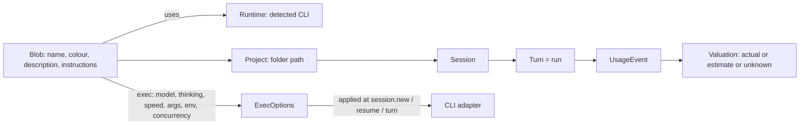

# Bloblex E2E plan: configurable blobs, sessions tree, analytics, release

## Director amendments (1 Oct 2026)

- Phase 2 is split: **2a** delivers agent storage, migration/backfill, `agent.*` RPCs/events, snapshot inclusion, and `session.new` by `agentId` without execution options. **2b** adds `ExecOptions`, adapter mappings, model catalog, concurrency and usage capture. Phases 3 and 4 depend only on 2a.
- Phase 1.5 verified relied-on capabilities against installed Claude 2.1.x, Codex CLI 0.159.3 and OpenCode 1.18.x, recording results in `docs/runtime-capabilities.md`; it is DONE (`2b4b92f`).
- Store the applied `exec_snapshot` per turn. Keep the first and most recent snapshot on the session for display.
- Custom arguments use a per-adapter allowlist; custom environment rejects secret-looking keys.
- Enforce both each blob's `max_concurrency` and a global concurrency cap.
- Before the agents migration, make and verify a timestamped database copy and document rollback. Never touch the live inspection app database or locked sidecars.
- Run the isolated-database `desktop:dev` native smoke test immediately after Phase 3, before Phase 4. Phase 7 retains the full native pass.
- Phase 6 ships only General, Agents, Runtimes and Permissions. Usage and Billing, Updates, language and theme remain deferred until they have working consumers.
- Multica is a clean-room behavioural reference only: design the UI independently and copy no Multica layout, text or assets. Record this in `THIRD_PARTY_NOTICES.md`.
- Revised order: **Phase 1 DONE (`7f10e60`)** and **Phase 1.5 DONE (`2b4b92f`)** -> 2a -> 3 -> native smoke -> 4 -> 2b -> 5 -> trimmed 6 -> 7.

## Starting point (historical source checkpoint: 1 Oct 2026, 22:40)

The UI and code facts below describe that checkpoint, before Tasks 1–3; reported test counts are not current acceptance evidence.

- **UI:**
  - The character engine, the companion island and the OpenMausBot-style shell are done (79/79 tests passing).
  - The sidebar lists one blob per detected CLI (`runtimeRows` in [apps/desktop/src/ui/App.tsx](apps/desktop/src/ui/App.tsx)).
- **Daemon:**
  - `session.new` takes only `{ runtimeId, projectPath, title }`.
  - [crates/bloblex-agent-core/src/lib.rs](crates/bloblex-agent-core/src/lib.rs) `NewSessionRequest` / `PromptRequest` carry no model, effort, speed or instructions.
  - `runtime.profile.*` holds launcher profiles (executable and fixed args), not personas.
- **Adapters:** all launch with fixed args.
  - Claude: `-p --output-format stream-json ...`
  - Codex: `app-server --listen stdio://`, with `thread/start` = cwd, approval and sandbox only.
  - OpenCode: `acp --cwd`; ACP can emit `usage_update` with context-window `used`/`size` and cost that appears cumulative for the session. It does not expose input/output/cache token buckets in that update; successful-run cost semantics remain unverified.
- **Storage** ([crates/bloblex-storage/src/lib.rs](crates/bloblex-storage/src/lib.rs)):
  - `sessions.project_path` exists.
  - `usage_events` already holds model and tokens, plus `usage_valuations` by basis.
  - `usage.summary` only returns global totals. There is no breakdown by agent, day or model.
- **Discovery:** `discover()` in [crates/bloblex-runtime/src/lib.rs](crates/bloblex-runtime/src/lib.rs) does not list models.
- **Icons:**
  - `assets/icon/bloblex.png` is a 963x958 PNG with alpha and transparent rounded corners already present; it shows a black rounded-square plate with a white blob.
  - `bloblex.ico` and `tray.png` are still the old ones. `tray.png` is embedded via `include_bytes!` at [apps/desktop/src-tauri/src/lib.rs](apps/desktop/src-tauri/src/lib.rs) around line 1361.
- **Multica licence:** Apache 2.0 plus extra conditions. These forbid embedding it in distributed products and require Multica branding on any derived UI. All Multica behaviour below is a clean-room reimplementation, and no Multica code is copied.

## Target data model

**New `agents` table (the blobs):**

- **Profile:** `id`, `name`, `description` (up to 255 characters), `instructions` (long text), `color` (one of 12 swatches or hex).
- **Execution:** `runtime_id`, `model` (null = CLI default), `thinking` (null = default), `service_tier` (null or the selected model's advertised tier ID; never a universal `standard`/`fast` string), `custom_args` (JSON), `custom_env` (JSON, non-secret keys only), `max_concurrency` (1-50).
- **Housekeeping:** `default_project`, `sort_order`, `archived`, `created_at`, `updated_at`.

**Changes to existing tables:**

- `sessions` gains `agent_id`. Phase 2b adds per-turn `exec_snapshot` persistence and first/latest snapshots on the session for display, because execution settings apply to new turns.
- `usage_events` gains `agent_id`, copied from the session at insert time.
- **Migration safety:** before migration, make and verify a timestamped copy of the SQLite database and document the rollback path. Never touch the live inspection app database or its locked sidecars. Create one default blob per existing runtime, then backfill `sessions.agent_id` from `runtime_id`.

## Phase 1: Logo and icons (small, independent) — DONE (`7f10e60`)

- Add `scripts/prepare-logo.ps1` (System.Drawing). Preserve the source alpha silhouette and rounded corners; retain exact alpha on pixels at or below 250 and treat higher alpha as opaque for matte processing. Remove only opaque near-white pixels connected to the border. Write the result centered and padded to `assets/icon/bloblex-master.png` at 1024x1024.
- Generate `bloblex.ico` from the master with 16/24/32/48/64/128/256 entries. The script writes the PNG-compressed ICO directly, without a new dependency.
- Produce `tray.png` at 32 px and the 128 px sidebar PNG from the same alpha-preserving master.
- Replace the CSS `BlobMark` in the sidebar header with the logo image.
- **Gate:** icons visible in the build, the installer and the tray, with no white halo on a dark taskbar.

## Phase 1.5: CLI capability spike (before execution support) — DONE (`2b4b92f`)

This phase verified the relied-on flags, fields and commands against Claude Code 2.1.286, Codex CLI 0.159.3 and OpenCode 1.18.34. Evidence, limitations and open questions are recorded in `docs/runtime-capabilities.md`; no credentials, secret values or private prompt text belong there. The spike covered `--model`, `--effort`, `--append-system-prompt-file`, `codex debug models`, `codex app-server generate-json-schema`, `OPENCODE_CONFIG_CONTENT` and `opencode models --verbose`. See the Phase 2b entry gate for remaining live checks.

## Phase 2a: Blob identity storage and RPCs (backend)

**Storage:**

- Add the `agents` migration, `agent.list/get/create/update/delete/reorder` RPCs and `agent.changed` events. Include agents in `app.snapshot`.

**Session linkage:**

- `session.new` accepts `{ agentId, projectPath, title? }`; keep `runtimeId` accepted for backward compatibility. Do not add execution options or per-turn execution snapshots in Phase 2a.

## Phase 2b: Execution options, adapters, models and usage (backend)

Phase 2b may start after Phase 1.5, which is recorded in `docs/runtime-capabilities.md`. Its entry gate below remains mandatory; capability shapes and static probes do not prove provider-side application.

**Agent core:**

- **Phase 2b implementation assumption:** add `ExecOptions { model, thinking, service_tier, instructions, extra_args, env }` to `NewSessionRequest`, the resume request and `PromptRequest`. Apply only the fields each adapter can verify at new-session, resume and per-turn scope; preserve unsupported/default states.

**Per-adapter mapping:** use the Phase 1.5 evidence for installed CLIs.

- **Claude:**
  - Spawn with typed `--model <id>` and `--effort <low|medium|high|xhigh|max>`. Valid aliases/full IDs and successful provider application remain only partly verified; preserve editable custom IDs and surface provider errors.
  - Keep instructions in an app-local temporary file and pass `--append-system-prompt-file <path>`. This flag appears in installed help text only: self-check its presence in installed help at spawn time. **Fallback design assumption:** if absent or rejected, deliberately prefix the first user stdin message of each applicable turn with a clearly delimited instruction block, record this lower-assurance route and hash in that turn's snapshot, and disclose that it is not a system instruction. Never silently claim system-level application.
  - The `--system-prompt-snapshot` default is on: the rendered initial prompt is reused for every request/resume, and changed launch instructions are ignored until compaction. Snapshot the instruction hash actually applied per turn; when desired instructions change, either start a fresh provider process/session or use a compaction-aware flow that demonstrably applies the new instructions. Do not claim changed instructions took effect merely because launch text changed.
  - No speed/service-tier option was found; hide the speed picker.
- **Codex:**
  - Load the typed model catalog from app-server `model/list` (paginate it); it includes per-model supported/default efforts and service tiers. Keep `codex debug models` as a diagnostics fallback. Equality between these catalogs has not been tested.
  - `thread/start` and `thread/resume` carry `model`, `developerInstructions`, `baseInstructions`, `serviceTier`, and `config`. Per-turn `turn/start` carries `model`, `effort`, `serviceTier`, and `serviceTierForTurn`.
  - Populate effort choices from each model's advertised efforts and send selected effort on `turn/start`. `config.model_reasoning_effort` on thread start/resume is unverified; do not depend on it until a live check proves acceptance.
  - Service-tier IDs come from the selected model catalog. For the observed `gpt-6-luna`, tier id `priority` is named Fast and described as 1.5x speed; `additional_speed_tiers: ["fast"]` is a separate field. `serviceTierForTurn: "default"` means standard. Never hard-code `fast` or `standard` as a service-tier ID.
  - Send instructions using `developerInstructions` or `baseInstructions` on start/resume. These fields prove request shape only; verify persistence and effective application across resume before claiming it.
- **OpenCode (ACP):**
  - Put the default model and agent prompt in `OPENCODE_CONFIG_CONTENT`; it is process-scoped, so each blob needing distinct configuration gets its own process environment. `opencode debug config` verified resolved configuration.
  - Populate a reasoning picker from each selected model's own `variants` keys in `opencode models --verbose` (33 of 52 observed models exposed variants); hide it when a model has none. ACP variant selection remains unproven, so do not claim a selected variant was applied until the entry-gate check passes.
  - Model/mode selection is represented by ACP `configOptions`; `mode` is build/plan, not reasoning effort. ACP model change through `session/set_config_option` was confirmed in a no-turn check.
  - No speed tier was exposed in the inspected ACP handshake/help; hide the speed picker.
- **Safety rules:**
  - Initial custom-argument allowlists are empty for Claude, Codex and OpenCode ACP. Use typed adapter-owned fields only; do not accept arbitrary option/value pairs.
  - Never let users control protocol, permission, cwd, transport, output-format, or configuration-source flags. Claude-owned flags include `-p`/`--print`, input/output format, hooks, permissions, tools, directories, settings/MCP/plugin config, model/effort/instruction flags and cwd. Codex-owned flags include `app-server`, listen/stdio, cwd, sandbox, approval, bypass/danger flags, `-c`/config, profile, strict-config, auth/remote transport and thread/turn payload fields. ACP-owned flags include `acp`, cwd, transport, config/env source, model/mode/variant, permission/auto-approval, and process cwd; never allow `run`, `serve` or TUI subcommands.
  - Custom environment remains a separately reviewed, explicit per-runtime allowlist; reject secret-looking keys and never log values. Never log instructions or put raw provider JSON into React.

**Model catalog:**

- **Bloblex design assumption:** add `runtime.models { runtimeId, refresh? }` RPC with a 60 s cache; the TTL is a local caching choice, not a verified CLI capability.
  - Codex: prefer authenticated app-server `model/list`, including per-model effort choices/defaults and service tiers; retain `codex debug models` only as a diagnostics fallback. The RPC exists in the installed schema but its response has not yet been live-compared with `debug models`.
  - Claude: optional stream-json `list_models` control-request probe; headless support is unproven. If unavailable or unsuccessful, return a static catalog with `fallback: true`; keep custom IDs editable.
  - OpenCode: `opencode models --verbose`, including provider/model metadata and each model's optional variant keys. Hide the reasoning selector for models without variants; ACP selection is gated below.
- Keep custom IDs editable for Claude as a recovery path for catalog gaps. Codex choices come from its advertised per-model catalog; OpenCode choices come from the verbose model list. Do not imply arbitrary IDs were provider-validated.

**Concurrency:**

- **Plan requirement (not an installed CLI capability claim):** the daemon enforces per-blob `max_concurrency` and a separate global active-turn cap, rejecting work beyond either limit with an actionable error. Queueing is deferred.

**Usage capture:**

- Claude stream-json `result` includes usage/model/cost fields, but only an API-error result was captured. Treat its zero values as unknown for a successful turn until a successful result-event check confirms semantics; do not synthesize zero.
- Codex usage comes from `thread/tokenUsage/updated`; that notification has token/context breakdown and thread/turn IDs, but no model. Associate model from the session/turn metadata.
- OpenCode ACP `session/update` includes `usage_update { used, size, cost: { amount, currency } }`. Store `used`/`size` as context-window figures, not token buckets; the observed `cost` appears cumulative for the session, so store it as provider-reported cost and never sum repeated cumulative snapshots. Verify the cumulative behavior on a successful run before deriving deltas or presenting finalized totals. Input/output/cache token buckets remain unknown, never zero.
- **Data-integrity rule:** mark a run unreported only when no usable provider usage/cost evidence exists for the requested metric; context-window figures alone do not make token totals known.
- **Phase 2a/2b storage requirement:** set `agent_id` on every usage event from its persisted session when available.

**Phase 2b entry gate:** the following PARTIAL findings require a live integration check before the UI claims the corresponding setting or data works:

- Claude: confirm the prompt-file flag at spawn (including fallback behavior), a successful non-error result-event's usage/model/cost semantics, requested effort application, and changed instructions after resume/compaction.
- Codex: verify nested `config.model_reasoning_effort` acceptance if used, and verify instructions are effectively retained/applied across resume; verify `model/list` against `debug models` before any assumption that catalogs match.
- OpenCode ACP: verify `session/set_config_option` in a live flow and verify variant selection end to end. Selection remains unproven even though model option changes passed a no-turn check.

For every adapter, separate request/launch evidence from provider-side applied-setting evidence. **Test-plan requirement:** tests assert argv, JSON-RPC and environment per adapter. **Plan requirement:** persist each turn's actual `exec_snapshot`; retain the first and latest snapshots on its session for display.

## Phase 3: Blob roster and editor (UI)

This phase depends only on Phase 2a. Execution settings may be displayed as unavailable until Phase 2b.

**Sidebar rows:**

- Each row shows the blob's own colour, name, last-message preview and time. Search covers blob names and session titles.
- Right-click actions: New session, Edit blob, Duplicate, Archive.
- "+" in the sidebar header opens Create blob.

**Blob page:** opened by clicking the header name or choosing "Edit blob". It replaces the chat pane, and Back returns to the chat. Four independently designed tabs. Multica is only a clean-room behavioural reference; do not reproduce its layout, text or assets:

- **Overview:**
  - The live blob preview at 96 px, plus name, description, runtime, model, status and quick usage.
  - The Grok Bot-style swatch grid: the same 12 colours, no shapes.
- **Sessions:** the full project/session list for this blob.
- **Usage:** the blob-scoped analytics described in Phase 5.
- **Settings:** the Profile card and the Execution card.
  - **Profile card:** colour, Name, Description with a "92 / 255" counter, and Instructions.
  - **Execution card:**
    - Runtime dropdown listing detected CLIs with an online dot.
    - Searchable Model picker with refresh and custom ID entry.
    - Thinking picker using the runtime's own levels, plus "Runtime default".
    - Speed: Standard, Fast or "Runtime default". It is hidden where unsupported.
    - Concurrency.
  - **Advanced:** custom args, environment and default project.
- Settings apply to new sessions and new turns. The UI says so, and the chat header model pill shows the snapshot actually applied.

**Engine:**

- `BlobCanvas` already accepts any `color`. Swap `providerColor(runtime)` for `agent.color` everywhere: the sidebar, chat, companion and minis.
- The provider stays visible as a small runtime label, not as the blob's colour.

**Gate:** create, edit, duplicate and archive persist across restarts. Two blobs on the same CLI run independently with different settings.

## Native smoke test (after Phase 3, before Phase 4)

Run `desktop:dev` only with an isolated database. Verify companion drag and transparency, tray behaviour, and a blob colour change. Preserve the running inspection app, its data and locked sidecars. Record the exact build and database used. Phase 7 still includes the complete native pass.

## Phase 4: Per-blob project and session tree (sidebar)

This phase depends on Phase 2a and the intervening native smoke gate; it does not depend on Phase 2b.

- A chevron sits on the right edge of each blob row, revealed on hover or focus. It never overlaps the face.
- Expanding the row shows an indented tree beneath it, styled like Claude desktop's grouping:
  - Projects, named by folder, each with its own chevron and a "+" for "New session in this project".
  - Under each project, sessions with a status dot, title and relative time. The active session is highlighted.
- "New session" offers this blob's recent projects first, then "Choose folder...".
- **Persistence:** keep expanded state per blob in localStorage. The header conversation switcher stays for keyboard users.
- The companion's chat tab follows the blob's selected session. Its pills switch between blobs.
- **Gate:** the same blob can hold several sessions in one project and in multiple projects. Selection, resume and cancel work from the tree, and the keyboard flow is arrow keys, Enter and context menu.

## Phase 5: Cost and usage analytics (clean-room behaviour)

**Daemon:**

- New `usage.analytics { from, to, bucket: day|week, tz, projectPath?, agentId? }`. It returns:
  - Totals: cost, tokens (input, output, cache read, cache write), run time, runs and failed runs.
  - A series per bucket for each of those metrics.
  - A leaderboard per blob: tokens, cost, time, runs, `unreportedRuns` and `unpricedModels`.
- Runs are turns. Run time is `completed_at - created_at`, and a failed run is a turn in the `error` state. OpenCode ACP `usage_update` provides context-window `used`/`size` and cost that appears cumulative for the session, but no input/output/cache buckets. Analytics must preserve those bucket values as unknown, avoid summing repeated cumulative cost snapshots, and gate derived totals on a successful check of cumulative semantics.

**Cost rule:**

- Cost = provider-reported actual cost + an API-rate estimate from `pricing_rules` / user overrides for the uncosted tokens.
- Unknown prices stay unknown, never $0.
- Prefix "≥" whenever any run is unreported or any model is unpriced, and show "N runs did not report usage".
- Subscription fees are shown separately and never mixed into usage cost.

**UI:** an Analytics view opened from the sidebar "Usage" link, with the same component reused on the blob Usage tab.

- Range picker (7d / 30d / 90d) and project filter.
- Four summary cards: Cost, Tokens, Run time, Runs.
- A bar chart with a Tokens / Cost / Time / Runs toggle and a Daily / Weekly toggle. Draw it with plain SVG; no chart dependency.
- The leaderboard with bars and the "≥" notation.
- An Errors tab listing failed turns.

**Gate:** the totals reconcile with the raw `usage_events` in fixture tests, partial data is labelled correctly, and timezone bucketing is tested.

## Phase 6: Settings redesign (Grok Bot style)

- Restyle `SettingsSheet` as a modal: a 200 px left nav with icons, and content laid out as titled groups of rounded card rows. Each row has a label on the left and a control on the right (a pill select or a toggle).
- **Pages:**
  - **General:**
    - System: start with Windows, close to tray, companion monitor.
    - Companion: show the companion, sounds.
  - **Agents:** the blob list, with links to each blob page.
  - **Runtimes:** detected CLIs, launcher profiles, auth state.
  - **Permissions:** default approval policy.
- Ship only General, Agents, Runtimes and Permissions. Usage and Billing, Updates, language and theme stay deferred until they have a working consumer. Keep only controls that have a working consumer. Anything else shows an "Unavailable" state. Follow the AGENTS.md invariant: "No copied provider authentication, primary terminal scraping, raw provider JSON in React, fabricated success/usage, or unknown prices presented as zero."
- **Gate:** every visible control persists and has an effect, and the existing settings tests stay green.

## Phase 7: Native verification and release hardening

- `npm run desktop:dev`, with an isolated DB, against the real app:
  - companion transparency, free drag, DPI and multiple monitors, and resize timing;
  - real file drop;
  - approvals in both windows;
  - the tray, including Pause all;
  - keyboard and focus;
  - reduced motion;
  - Quit and process-tree cleanup.
- Carry over the open items from [docs/implementation-status.md](docs/implementation-status.md): installer, signing, updater, clean-VM install, and WSL.
- **Later options:** a Pi adapter (`--model`, `--thinking`, `-p --mode json`), task queueing beyond the concurrency limit, and avatar upload or generation.

## Cross-cutting rules

- Prompts and instructions travel only via stdin, protocol fields or temp files, never as large argv strings.
- No credentials appear in logs or docs.
- The daemon owns state. React only renders normalized data.
- Each phase ships with:
  - unit and mounted tests;
  - fixture-preview pages (extend [apps/desktop/src/preview/fixtureBridge.ts](apps/desktop/src/preview/fixtureBridge.ts));
  - an updated [SESSION_HANDOFF.md](SESSION_HANDOFF.md).
- Record the clean-room note for Multica in [THIRD_PARTY_NOTICES.md](THIRD_PARTY_NOTICES.md).
- Store this plan as `docs/E2E_PLAN_V2.md` and link it from `SESSION_HANDOFF.md` and `AGENTS.md`.

## Suggested order

Phase 1 and 1.5 -> 2a -> 3 -> native smoke -> 4 -> 2b -> 5 -> 6 (General, Agents, Runtimes, Permissions only) -> 7.
