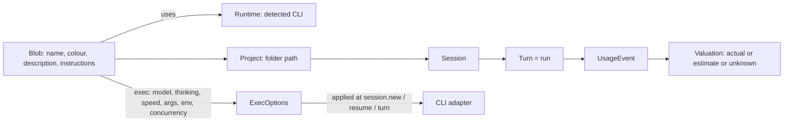

# Bloblex E2E plan: configurable blobs, sessions tree, token analytics, provider quota, release

## Status (5 October 2026)

Evidence is the merge commit on this branch's history. "Implemented" means the code and its unit or fake-process tests are on main. It does not mean a live provider session or a native window pass of the current tree. The only recorded native smoke is the isolated-database run of the Phase 3 tree (`5138c8e`, revision `e770db8`); it does not cover Phases 4, 2b, 5, or 6. Phase 7 is still pending.

| Phase | Status | Evidence |
| --- | --- | --- |
| 1 Logo and icons | Implemented | `7f10e60` |
| 1.5 CLI capability record | Implemented (recorded probes, not a live session pass) | `2b4b92f` |
| 2a Blob storage and RPCs | Implemented | `1b0232a` |
| 3 Blob roster and editor | Implemented. Isolated native smoke of that tree, with open defects | `92f626a`, smoke `5138c8e` |
| 4 Project and session tree | Implemented. Unit and mounted tests only | `395fd78` |
| 2b Execution options | Implemented (storage, Claude, OpenCode, Codex). Fake-process tests only | `2dc0ae9`, `013e32b`, `73c4f03`, `9045022`, `7c0eb77` |
| 5 Token analytics and provider quota | Token analytics remain; cost valuation and budget/pricing/subscription features are retired in the current worktree. Codex, Claude Code OAuth, and OpenCode Go quota sources have normalized fake coverage plus isolated live-fetch evidence for Claude Code 2.1.291, Codex codex-cli 0.160.1, and OpenCode 1.18.34. Generic OpenCode provider quota is omitted; native UI remains unverified. | `55808fa`, `07bb620`, current uncommitted changes |
| 6 Settings | General, Agents and Updates remain. Usage & limits is removed from active settings navigation. | `0314cb2`, `aabbd0f`, `aea5eb1` |
| 7 Native verification and release | Partly done: updater, release script and beta releases. Native checks, signing and clean install open | `f15f9d2`…`889bb93`, `v0.1.0-beta.1`–`beta.3` |

Work after the plan phases (redesign, conversation management, model list provenance, usage limits and sharing) is listed in [implementation-status.md](implementation-status.md).

## Director amendments (1 Oct 2026)

- Phase 2 is split: **2a** delivers agent storage, migration/backfill, `agent.*` RPCs/events, snapshot inclusion, and `session.new` by `agentId` without execution options. **2b** adds `ExecOptions`, adapter mappings, model catalog, concurrency and usage capture. Phases 3 and 4 depend only on 2a.
- Phase 1.5 verified relied-on capabilities against installed Claude 2.1.x, Codex CLI 0.159.3 and OpenCode 1.18.x, recording results in `docs/runtime-capabilities.md`; it is DONE (`2b4b92f`).
- Store the applied `exec_snapshot` per turn. Keep the first and most recent snapshot on the session for display.
- Custom arguments use a per-adapter allowlist; custom environment rejects secret-looking keys.
- Enforce both each blob's `max_concurrency` and a global concurrency cap.
- Before the agents migration, make and verify a timestamped database copy and document rollback. Never touch the live inspection app database or locked sidecars.
- Run the isolated-database `desktop:dev` native smoke test immediately after Phase 3, before Phase 4. Phase 7 retains the full native pass.
- Phase 6 ships only General, Agents, Runtimes and Permissions. Usage and Billing, Updates, language and theme remain deferred until they have working consumers.
- Revised order: **Phase 1 DONE (`7f10e60`)** and **Phase 1.5 DONE (`2b4b92f`)** -> 2a -> 3 -> native smoke -> 4 -> 2b -> 5 -> trimmed 6 -> 7.

## Starting point (historical source checkpoint: 1 Oct 2026, 22:40)

The UI and code facts below describe that checkpoint, before Tasks 1–3; reported test counts are not current acceptance evidence.

- **UI:**
  - The character engine, the companion island and the chat-style shell are done (79/79 tests passing).
  - The sidebar lists one blob per detected CLI (`runtimeRows` in [apps/desktop/src/ui/App.tsx](apps/desktop/src/ui/App.tsx)).
- **Daemon:**
  - `session.new` takes only `{ runtimeId, projectPath, title }`.
  - [crates/bloblex-agent-core/src/lib.rs](crates/bloblex-agent-core/src/lib.rs) `NewSessionRequest` / `PromptRequest` carry no model, effort, speed or instructions.
  - `runtime.profile.*` holds launcher profiles (executable and fixed args), not personas.
- **Adapters:** all launch with fixed args.
  - Claude: `-p --output-format stream-json ...`
  - Codex: `app-server --listen stdio://`, with `thread/start` = cwd, approval and sandbox only.
  - OpenCode: `acp --cwd`; ACP can emit `usage_update` with context-window `used`/`size` and cost that appears cumulative for the session. It does not expose input/output/cache token buckets in that update; successful-run cost semantics remain unverified.
- **Storage** ([crates/bloblex-storage/src/lib.rs](crates/bloblex-storage/src/lib.rs)):
  - `sessions.project_path` exists.
  - `usage_events` already holds model and tokens, plus `usage_valuations` by basis.
  - `usage.summary` only returns global totals. There is no breakdown by agent, day or model.
- **Discovery:** `discover()` in [crates/bloblex-runtime/src/lib.rs](crates/bloblex-runtime/src/lib.rs) does not list models.
- **Icons:**
  - `assets/icon/bloblex.png` is a 963x958 PNG with alpha and transparent rounded corners already present; it shows a black rounded-square plate with a white blob.
  - `bloblex.ico` and `tray.png` are still the old ones. `tray.png` is embedded via `include_bytes!` at [apps/desktop/src-tauri/src/lib.rs](apps/desktop/src-tauri/src/lib.rs) around line 1361.

## Target data model

**New `agents` table (the blobs):**

- **Profile:** `id`, `name`, `description` (up to 255 characters), `instructions` (long text), `color` (one of 12 swatches or hex).
- **Execution:** `runtime_id`, `model` (null = CLI default), `thinking` (null = default), `service_tier` (null or the selected model's advertised tier ID; never a universal `standard`/`fast` string), `custom_args` (JSON), `custom_env` (JSON, non-secret keys only), `max_concurrency` (1-50).
- **Housekeeping:** `default_project`, `sort_order`, `archived`, `created_at`, `updated_at`.

**Changes to existing tables:**

- `sessions` gains `agent_id`. Phase 2b adds per-turn `exec_snapshot` persistence and first/latest snapshots on the session for display, because execution settings apply to new turns.
- `usage_events` gains `agent_id`, copied from the session at insert time.
- **Migration safety:** before migration, make and verify a timestamped copy of the SQLite database and document the rollback path. Never touch the live inspection app database or its locked sidecars. Create one default blob per existing runtime, then backfill `sessions.agent_id` from `runtime_id`.

## Phase 1: Logo and icons (small, independent) — DONE (`7f10e60`)

- Add `scripts/prepare-logo.ps1` (System.Drawing). Preserve the source alpha silhouette and rounded corners; retain exact alpha on pixels at or below 250 and treat higher alpha as opaque for matte processing. Remove only opaque near-white pixels connected to the border. Write the result centered and padded to `assets/icon/bloblex-master.png` at 1024x1024.
- Generate `bloblex.ico` from the master with 16/24/32/48/64/128/256 entries. The script writes the PNG-compressed ICO directly, without a new dependency.
- Produce `tray.png` at 32 px and the 128 px sidebar PNG from the same alpha-preserving master.
- Replace the CSS `BlobMark` in the sidebar header with the logo image.
- **Gate:** icons visible in the build, the installer and the tray, with no white halo on a dark taskbar.

## Phase 1.5: CLI capability spike (before execution support) — DONE (`2b4b92f`)

This phase verified the relied-on flags, fields and commands against Claude Code 2.1.286, Codex CLI 0.159.3 and OpenCode 1.18.34. Evidence, limitations and open questions are recorded in `docs/runtime-capabilities.md`; no credentials, secret values or private prompt text belong there. The spike covered `--model`, `--effort`, `--append-system-prompt-file`, `codex debug models`, `codex app-server generate-json-schema`, `OPENCODE_CONFIG_CONTENT` and `opencode models --verbose`. See the Phase 2b entry gate for remaining live checks.

## Phase 2a: Blob identity storage and RPCs (backend)

**Storage:**

- Add the `agents` migration, `agent.list/get/create/update/delete/reorder` RPCs and `agent.changed` events. Include agents in `app.snapshot`.

**Session linkage:**

- `session.new` accepts `{ agentId, projectPath, title? }`; keep `runtimeId` accepted for backward compatibility. Do not add execution options or per-turn execution snapshots in Phase 2a.

## Phase 2b: Execution options, adapters, models and usage (backend)

Phase 2b may start after Phase 1.5, which is recorded in `docs/runtime-capabilities.md`. Its entry gate below remains mandatory; capability shapes and static probes do not prove provider-side application.

**Agent core:**

- **Phase 2b implementation assumption:** add `ExecOptions { model, thinking, service_tier, instructions, extra_args, env }` to `NewSessionRequest`, the resume request and `PromptRequest`. Apply only the fields each adapter can verify at new-session, resume and per-turn scope; preserve unsupported/default states.

**Per-adapter mapping:** use the Phase 1.5 evidence for installed CLIs.

- **Claude:**
  - Spawn with typed `--model <id>` and `--effort <low|medium|high|xhigh|max>`. An unknown `--effort` value is ignored with a warning, not a hard CLI error. An unknown model id is not an invalid flag: startup warns, and a prompted stream-json turn can also emit `unrecognized_model` (natural exit not captured). Keep custom IDs editable and surface both. Hide effort when the selected `list_models` row has no `supportedEffortLevels`. Successful provider application of a requested effort remains unverified.
  - Keep instructions in an app-local temporary file and pass `--append-system-prompt-file <path>`. A no-model probe showed the flag exists and takes a path, so the body stays out of argv. **Fallback design assumption:** if a future build rejects the flag, deliberately prefix the first user stdin message of each applicable turn with a clearly delimited instruction block, record this lower-assurance route and hash in that turn's snapshot, and disclose that it is not a system instruction. Never silently claim system-level application. Whether the file body appears in a successful turn is still an entry-gate check.
  - The `--system-prompt-snapshot` default is on: help says the rendered initial prompt is reused for every request/resume, and changed launch instructions are ignored until compaction. That help sentence names the inline prompt flags, not the `-file` forms. Snapshot the instruction hash actually applied per turn; when desired instructions change, either start a fresh provider process/session or use a compaction-aware flow that demonstrably applies the new instructions. Do not claim changed instructions took effect merely because launch text changed.
  - No speed/service-tier spawn flag exists (`--speed` and `--service-tier` are unknown options). Hide the speed picker. Catalog `supportsFastMode` and usage `speed` are reports, not setters.
- **Codex:**
  - Load the typed model catalog from app-server `model/list` (paginate it); it includes per-model supported/default efforts and service tiers. Keep `codex debug models` as a diagnostics fallback. Equality between these catalogs has not been tested.
  - `thread/start` and `thread/resume` carry `model`, `developerInstructions`, `baseInstructions`, `serviceTier`, and `config`. Per-turn `turn/start` carries `model`, `effort`, `serviceTier`, and `serviceTierForTurn`. There is no top-level effort on `thread/start`, and no developer-instructions field on `turn/start`.
  - Populate effort choices from each model's advertised efforts and send the selected effort on `turn/start`. Efforts are not one global enum: a 2026-10-02 `codex debug models` snapshot included `ultra` on some slugs (for example `gpt-6-sol`) and stopped earlier on others (`gpt-6-luna` at `max`, `gpt-5.5` at `xhigh`). That snapshot is an example of per-slug variation, not a permanent catalog. `config.model_reasoning_effort` is a named config-schema field; acceptance inside `thread/start.config` is unverified. Do not depend on the nested key until a live check proves it.
  - Service-tier IDs come from the selected model catalog. The observed Fast tier id is `priority` and the name is `Fast`. Description text is time-varying (`1.5x speed` in the Director's runs; `2x speed, increased usage` in another run) and must not be parsed. `additional_speed_tiers: ["fast"]` is a separate field. `serviceTierForTurn: "default"` means standard. Never hard-code `fast` or `standard` as a service-tier ID.
  - Send instructions using `developerInstructions` on start and resume (`baseInstructions` is a different field). These fields prove request shape only; the response does not echo them. Verify persistence and effective application across resume before claiming it.
- **OpenCode (ACP):**
  - Put the default model and agent prompt in `OPENCODE_CONFIG_CONTENT`; it is process-scoped, so each blob needing distinct configuration gets its own process environment. `opencode debug config` verified that the JSON is merged. A custom agent prompt is not active until `session/set_config_option` sets `mode` to that agent (until then the current mode stays `build`). Re-apply both on every spawn, including resume.
  - Populate a reasoning picker from each selected model's own `variants` keys in `opencode models --verbose`. On the real host (Director-verified, 2026-10-02) 33 of 52 models exposed variants; an isolated empty home's 8-model list does not describe this machine. Hide the picker when a model has no variants. After `session/set_config_option` selects a model that has variants, ACP adds config option `effort`. `default` is synthetic and is not a verbose `variants` key. For `ling-3.0-flash-fin-free` on the real host the values were `low`, `medium`, `high`, and `default`. Do not claim the provider applied that effort on a successful turn until the entry-gate check passes.
  - Model selection is `session/set_config_option` (`configId: model`) or `session/set_model` with `modelId` (not `model`). `availableModels` was absent on `session/new`. `mode` is build/plan, or a custom agent id, not reasoning effort. The `initialized` notification logs `Method not found` on stderr, sends no JSON-RPC response, and does not block `session/new`; leave the handshake as it is.
  - No speed tier was exposed in the inspected ACP handshake/help; hide the speed picker.
- **Safety rules:**
  - User `extra_args` allowlists are empty for Claude, Codex and OpenCode ACP. Do not accept arbitrary option/value pairs. The Claude adapter may add only `--model`, `--effort`, `--append-system-prompt-file`, and `--system-prompt-snapshot`. `--fallback-model` stays off that list until a probe shows the flag exists.
  - Never let users control protocol, permission, cwd, transport, output-format, or configuration-source flags. Claude-owned flags include `-p`/`--print`, input/output format, hooks, permissions, tools, directories, settings/MCP/plugin config, model/effort/instruction flags, `--system-prompt` (argv text), and cwd. Codex-owned flags include `app-server`, listen/stdio, cwd, sandbox, approval, bypass/danger flags, `-c`/config, profile, strict-config, auth/remote transport and thread/turn payload fields. ACP-owned flags include `acp`, `--cwd`, `--port`, `--hostname`, `--auto`, `--pure`, TUI `-m`/`--model`, `--continue`, `--session`, `--prompt`, `--agent`, config/env source, and process cwd; never allow `run`, `serve` or TUI subcommands.
  - Custom environment remains a separately reviewed, explicit per-runtime allowlist; reject secret-looking keys and never log values. Never log instructions or put raw provider JSON into React.

**Model catalog:**

- **Bloblex design assumption:** add `runtime.models { runtimeId, refresh? }` RPC with a 60 s cache; the TTL is a local caching choice, not a verified CLI capability.
  - Codex: prefer authenticated app-server `model/list`, including per-model effort choices/defaults and service tiers (efforts are per model and can include `ultra`); retain `codex debug models` only as a diagnostics fallback. The RPC exists in the installed schema but its response has not yet been live-compared with `debug models`.
  - Claude: headless stream-json `control_request` `list_models` works (Director-verified, no model call). Model counts and the `default` alias are host-dependent and must not be hard-coded: QA reported 12 models on the real profile with `default` resolving to `claude-sonnet-5-5` (not Director-verified); an isolated empty home returned 5 models with `default` resolving to `claude-opus-5-5`. If the control response fails, return a static catalog with `fallback: true`; keep custom IDs editable.
  - OpenCode: `opencode models --verbose`, including provider/model metadata and each model's optional variant keys. Real host, Director-verified, 2026-10-02: 52 models, 33 with variants. Hide the reasoning selector for models without variants. ACP selection is config option `effort` after that model is selected, including synthetic `default`; a successful turn that shows the effort was applied is gated below.
- Keep custom IDs editable for Claude as a recovery path for catalog gaps. Codex choices come from its advertised per-model catalog; OpenCode choices come from the verbose model list. Do not imply arbitrary IDs were provider-validated.

**Concurrency:**

- **Plan requirement (not an installed CLI capability claim):** the daemon enforces per-blob `max_concurrency` and a separate global active-turn cap, rejecting work beyond either limit with an actionable error. Queueing is deferred.

**Usage capture:**

- Claude stream-json `result` includes usage/model/cost fields, but only an API-error result was captured (`model: null`, empty `modelUsage`, zero tokens and `total_cost_usd`). Treat those zeros as unknown for a successful turn until a successful result-event check confirms semantics; do not synthesize zero. On a success result, do not assume top-level `result.model` is the proof of model; `modelUsage` keys are the candidate and were empty on the error event.
- Codex usage comes from `thread/tokenUsage/updated`; that notification has token/context breakdown and thread/turn IDs, but no model and no cost. Associate model from the thread/start response or `thread/settings/updated`.
- OpenCode ACP `session/update` includes `usage_update { used, size, cost: { amount, currency } }`. The plan claim that OpenCode reports no usage is false. Store `used`/`size` as context-window figures, not token buckets. The only captured event was a failed request with `cost.amount` 0, so do not treat that zero as a successful free turn, and do not assume `amount` is cumulative until a successful run shows it. Never sum repeated snapshots if they are cumulative. Input/output/cache token buckets remain unknown, never zero.
- **Data-integrity rule:** mark a run unreported only when no usable provider usage/cost evidence exists for the requested metric; context-window figures alone do not make token totals known.
- **Phase 2a/2b storage requirement:** set `agent_id` on every usage event from its persisted session when available.

**Phase 2b entry gate:** the following still require a live integration check before the UI claims the corresponding setting or data works. Settled and removed from this list: headless Claude `list_models`; `--append-system-prompt-file` exists and takes a path; unknown `--effort` is ignored with a warning; OpenCode model `set_config_option` and `session/set_model` `modelId`; ACP `effort` appears after a model with variants is selected, including synthetic `default`; a custom agent is listed but inactive until mode is set to it; `usage_update` is emitted.

- Claude: whether `--append-system-prompt-file` content appears in a successful turn; a successful non-error result's usage, model, and cost semantics; requested effort application on a successful turn; changed instructions after resume or compaction.
- Codex: nested `config.model_reasoning_effort` acceptance if that key is used; whether an unlisted effort or tier is rejected or silently changed; whether `developerInstructions` are actually retained across a resume that must keep them; `model/list` against `debug models` on the same profile before assuming the catalogs match.
- OpenCode ACP: a successful turn's usage/cost semantics (`cost.amount` cumulative versus a delta; token buckets stay unknown); a round-trip that sets `effort` and shows the provider used it. Cross-turn survival of the custom-agent prompt inside one process was not observed.

For every adapter, separate request/launch evidence from provider-side applied-setting evidence. **Test-plan requirement:** tests assert argv, JSON-RPC and environment per adapter. **Plan requirement:** persist each turn's actual `exec_snapshot`; retain the first and latest snapshots on its session for display.

## Phase 3: Blob roster and editor (UI)

This phase depends only on Phase 2a. Execution settings may be displayed as unavailable until Phase 2b.

**Sidebar rows:**

- Each row shows the blob's own colour, name, last-message preview and time. Search covers blob names and session titles.
- Right-click actions: New session, Edit blob, Duplicate, Archive.
- "+" in the sidebar header opens Create blob.

**Blob page:** opened by clicking the header name or choosing "Edit blob". It replaces the chat pane, and Back returns to the chat. Four independently designed tabs. external reference is only a clean-room behavioural reference; do not reproduce its layout, text or assets:

- **Overview:**
  - The live blob preview at 96 px, plus name, description, runtime, model, status and quick usage.
  - The chat-style swatch grid: the same 12 colours, no shapes.
- **Sessions:** the full project/session list for this blob.
- Usage opens from the existing shell and remains separate from this editor page.
- **Settings:** the Profile card and the Execution card.
  - **Profile card:** colour, Name, Description with a "92 / 255" counter, and Instructions.
  - **Execution card:**
    - Runtime dropdown listing detected CLIs with an online dot.
    - Searchable Model picker with refresh and custom ID entry.
    - Thinking picker using the runtime's own levels, plus "Runtime default".
    - Speed: Standard, Fast or "Runtime default". It is hidden where unsupported.
    - Concurrency.
  - **Advanced:** custom args, environment and default project.
- Settings apply to new sessions and new turns. The UI says so, and the chat header model pill shows the snapshot actually applied.

**Engine:**

- `BlobCanvas` already accepts any `color`. Swap `providerColor(runtime)` for `agent.color` everywhere: the sidebar, chat, companion and minis.
- The provider stays visible as a small runtime label, not as the blob's colour.

**Gate:** create, edit, duplicate and archive persist across restarts. Two blobs on the same CLI run independently with different settings.

## Native smoke test (after Phase 3, before Phase 4)

Run `desktop:dev` only with an isolated database. Verify companion drag and transparency, tray behaviour, and a blob colour change. Preserve the running inspection app, its data and locked sidecars. Record the exact build and database used. Phase 7 still includes the complete native pass.

## Phase 4: Per-blob project and session tree (sidebar)

This phase depends on Phase 2a and the intervening native smoke gate; it does not depend on Phase 2b.

- A chevron sits on the right edge of each blob row, revealed on hover or focus. It never overlaps the face.
- Expanding the row shows an indented tree beneath it, styled like Claude desktop's grouping:
  - Projects, named by folder, each with its own chevron and a "+" for "New session in this project".
  - Under each project, sessions with a status dot, title and relative time. The active session is highlighted.
- "New session" offers this blob's recent projects first, then "Choose folder...".
- **Persistence:** keep expanded state per blob in localStorage. The header conversation switcher stays for keyboard users.
- The companion's chat tab follows the blob's selected session. Its pills switch between blobs.
- **Gate:** the same blob can hold several sessions in one project and in multiple projects. Selection, resume and cancel work from the tree, and the keyboard flow is arrow keys, Enter and context menu.

## Phase 5: Token analytics and provider quota

**Token analytics:**

- `usage.analytics { from, to, bucket: day|week, tz, projectPath?, agentId? }` continues to support token buckets, runtime, runs and failures. Monetary values, price estimates, subscriptions and budgets are not current product features. Historical pricing, subscription, valuation and budget rows remain untouched in storage.
- Unknown token fields remain unknown. Input, output, cache read/write and reasoning stay as distinct reported-usage buckets. Context-window figures are never presented as token consumption.
- The existing Analytics view retains Tokens / Time / Runs charts, project/date filters and failed-turn details. An always-visible compact bottom row shows supported quota; the existing Usage sheet shows token totals and quota separately, with an explicit non-blocking refresh action and reset time/countdown when reported. No additional page or settings navigation is introduced.

**Quota service:**

- Expose normalized quota snapshots through `quota.list`, `quota.refresh` and `quota.updated`; never send raw provider responses to React.
- Poll in the background every five minutes, use a ten-second request timeout, single-flight each provider, back off after errors and retain the last successful snapshot. Polling does not delay daemon readiness or block prompts.
- Codex is supported through the structured `account/rateLimits/read` method matched to the checked-in Codex 0.159.3 app-server schema. Claude Code uses the existing access token in its Windows credentials file to call the OAuth usage endpoint without refreshing or writing credentials. OpenCode Go uses `OPENCODE_API_KEY` or the existing OpenCode `opencode-go` entry from `auth.json` / credential SQLite (read-only/query-only) and the Go usage endpoint. Only normalized percentages and reset times are persisted or sent to the UI; tokens and raw payloads are not. Generic OpenCode providers remain omitted because ACP only reports per-session context `used/size`, not account limits. Isolated daemon fetches succeeded for Claude Code 2.1.291, Codex codex-cli 0.160.1, and OpenCode 1.18.34, without prompts or the user's database. Sanitized output/docs retained provider/status/window presence only; the daemon's normal cache wrote normalized quota snapshots to ignored `target/provider-quota-live-smoke/quota.db`, which contains no credentials or raw payloads and remains because cleanup was blocked. Native UI behavior remains unverified.
- Reuse CLI-owned authentication. User-authorized quota checks may read existing tokens/keys transiently in process memory, but never persist or log them, forward them to the renderer, refresh them, or modify CLI authentication. Do not scrape a terminal or expose provider payloads. Unknown fields remain unavailable rather than zero.

**Gate:** token analytics and quota normalization/cache/backoff are deterministic in fixture tests, v9 history survives the additive quota migration, and shell/Usage UI presents quota separately from token use. Isolated live quota polling is verified for Claude Code 2.1.291, Codex codex-cli 0.160.1, and OpenCode 1.18.34. Live Claude/Codex/OpenCode turns and native UI behavior remain separate unverified gates.

## Phase 6: Settings redesign (reference chat app style)

- Restyle `SettingsSheet` as a modal: a 200 px left nav with icons, and content laid out as titled groups of rounded card rows. Each row has a label on the left and a control on the right (a pill select or a toggle).
- **Pages:**
  - **General:**
    - System: start with Windows, close to tray, companion monitor.
    - Companion: show the companion, sounds.
  - **Agents:** the blob list, with links to each blob page.
  - **Runtimes:** detected CLIs, launcher profiles, auth state.
  - **Permissions:** default approval policy.
- General, Agents and Updates remain. Monetary usage/billing, budget, pricing and subscription controls are retired; quota settings are not added. Keep only controls that have a working consumer. Anything else shows an "Unavailable" state. Follow the AGENTS.md invariant: "No copied provider authentication, primary terminal scraping, raw provider JSON in React, fabricated success/usage, or unknown prices presented as zero."
- **Gate:** every visible control persists and has an effect, and the existing settings tests stay green.

## Phase 7: Native verification and release hardening

- `npm run desktop:dev`, with an isolated DB, against the real app:
  - companion transparency, free drag, DPI and multiple monitors, and resize timing;
  - real file drop;
  - approvals in both windows;
  - the tray, including Pause all;
  - keyboard and focus;
  - reduced motion;
  - Quit and process-tree cleanup.
- Carry over the open items from [docs/implementation-status.md](docs/implementation-status.md): installer, signing, updater, clean-VM install, and WSL.
- **Later options:** a Pi adapter (`--model`, `--thinking`, `-p --mode json`), task queueing beyond the concurrency limit, and avatar upload or generation.

## Cross-cutting rules

- Prompts and instructions travel only via stdin, protocol fields or temp files, never as large argv strings.
- No credentials appear in logs or docs.
- The daemon owns state. React only renders normalized data.
- Each phase ships with:
  - unit and mounted tests;
  - fixture-preview pages (extend [apps/desktop/src/preview/fixtureBridge.ts](apps/desktop/src/preview/fixtureBridge.ts));
  - an updated [SESSION_HANDOFF.md](SESSION_HANDOFF.md).
- Store this plan as `docs/E2E_PLAN_V2.md` and link it from `SESSION_HANDOFF.md` and `AGENTS.md`.

## Suggested order

Phase 1 and 1.5 -> 2a -> 3 -> native smoke -> 4 -> 2b -> 5 -> 6 (General, Agents, Runtimes, Permissions only) -> 7.
